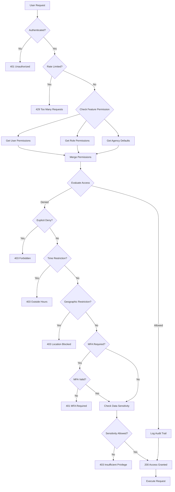
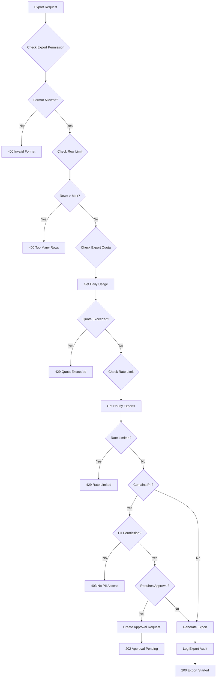
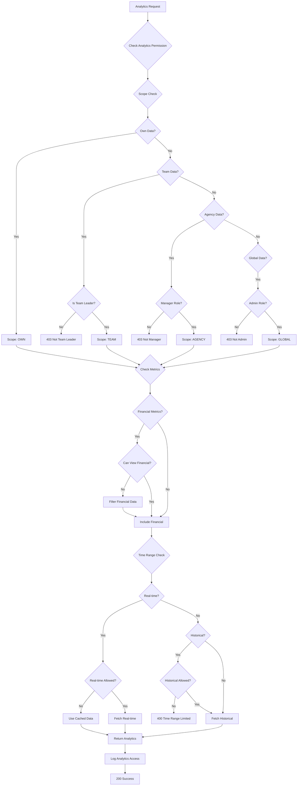
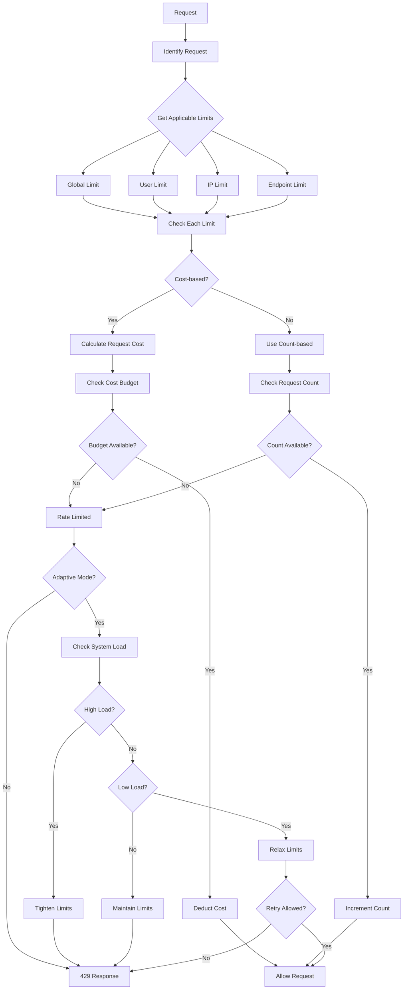
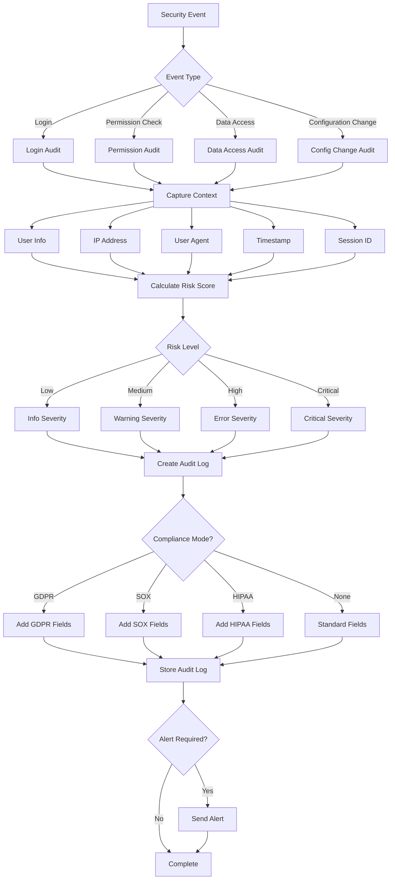
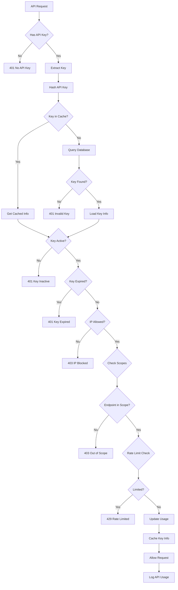
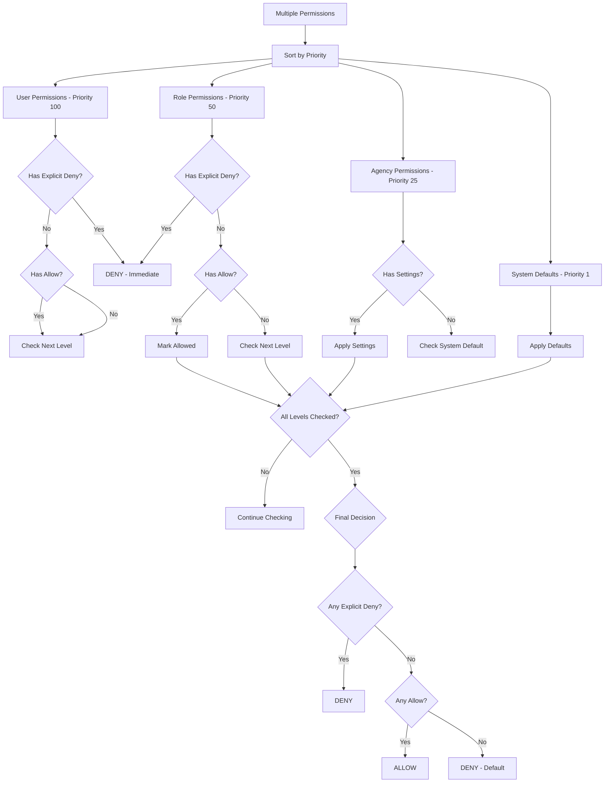
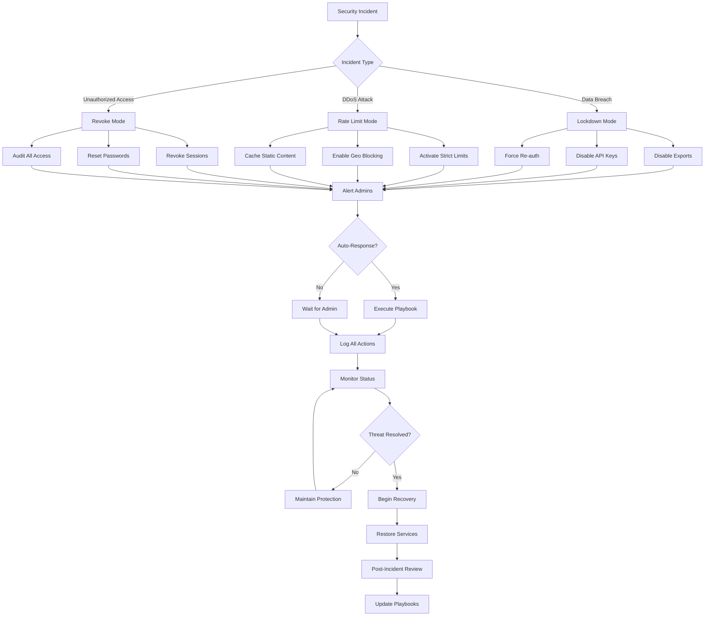
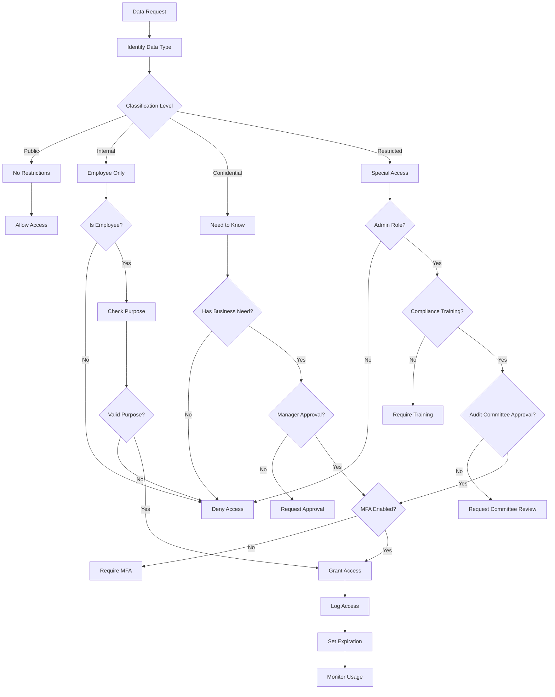

# Permission Flow Diagrams

## Overview

This document provides visual representations of permission flows in the Agency Dark platform using Mermaid diagrams.

## Main Permission Check Flow

## Export Permission Flow

## Analytics Permission Flow

## Rate Limiting Flow

## Audit Trail Flow

## API Key Validation Flow

## Permission Priority Resolution

## Emergency Response Flow

## Data Classification Flow

## Implementation Notes

1. **Performance Considerations**
   - Cache permission results for 5 minutes
   - Use Redis for distributed caching
   - Batch permission checks when possible

2. **Security Considerations**
   - Always fail closed (deny by default)
   - Log all permission denials
   - Alert on unusual patterns

3. **Monitoring Points**
   - Permission check latency
   - Cache hit rates
   - Denial rates by user/role
   - Rate limit violations

4. **Integration Points**
   - Authentication service
   - Rate limiting service
   - Audit logging service
   - Cache layer
   - Database layer