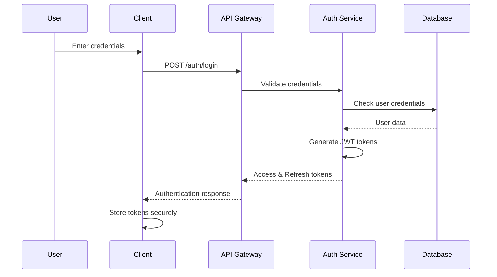
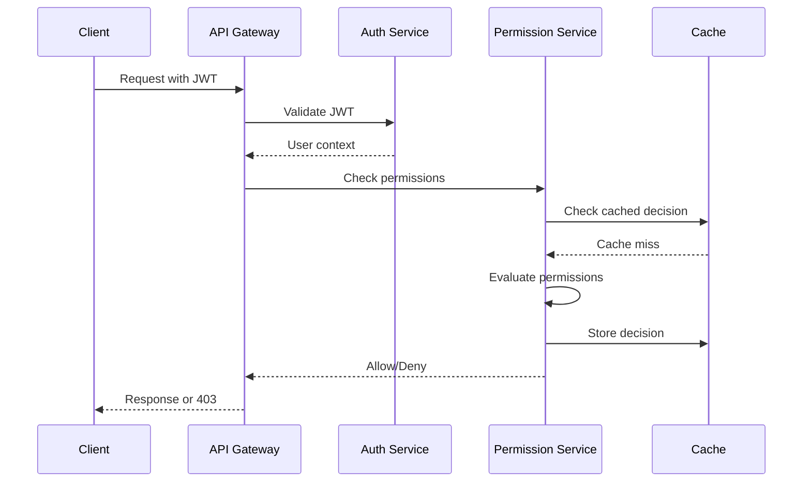

# Security Architecture Documentation

## Table of Contents

1. [Overview](#overview)
2. [Security Principles](#security-principles)
3. [Architecture Components](#architecture-components)
4. [Authentication & Authorization](#authentication--authorization)
5. [Permission System](#permission-system)
6. [Rate Limiting](#rate-limiting)
7. [Audit System](#audit-system)
8. [API Security](#api-security)
9. [Data Protection](#data-protection)
10. [Security Monitoring](#security-monitoring)
11. [Incident Response](#incident-response)
12. [Compliance](#compliance)

## Overview

The Agency Dark platform implements a comprehensive, multi-layered security architecture designed to protect sensitive data, ensure compliance with regulations, and maintain system integrity. This document outlines the security components, their interactions, and implementation details.

### Key Security Features

- **Role-Based Access Control (RBAC)** with 6 hierarchical user roles
- **Feature-Specific Permissions** with granular access control
- **Dynamic Rate Limiting** with multiple algorithms and cost-based throttling
- **Comprehensive Audit Trail** with tamper-resistant logging
- **Multi-Factor Authentication (MFA)** for sensitive operations
- **API Key Management** with secure generation and rotation
- **Real-time Threat Detection** and automated response
- **Data Encryption** at rest and in transit
- **Geographic Access Control** and time-based restrictions

## Security Principles

### 1. Defense in Depth
Multiple layers of security controls to protect against various attack vectors:
- Network security (firewalls, DDoS protection)
- Application security (input validation, output encoding)
- Data security (encryption, access controls)
- Operational security (monitoring, incident response)

### 2. Principle of Least Privilege
Users and services are granted minimum permissions required for their function:
- Default deny policy
- Explicit permission grants
- Regular permission audits
- Time-limited access where appropriate

### 3. Zero Trust Architecture
Never trust, always verify:
- Continuous authentication and authorization
- Micro-segmentation of services
- Encrypted communications between components
- Regular security posture assessments

### 4. Security by Design
Security considerations integrated throughout the development lifecycle:
- Threat modeling during design
- Secure coding practices
- Security testing in CI/CD
- Regular security reviews

## Architecture Components

### High-Level Architecture

```
┌─────────────────────────────────────────────────────────────┐
│                        Client Layer                          │
│  (Web App, Mobile App, API Clients)                        │
└─────────────────────┬───────────────────────────────────────┘
                      │ HTTPS/WSS
┌─────────────────────▼───────────────────────────────────────┐
│                    API Gateway Layer                         │
│  - Rate Limiting                                            │
│  - Request Validation                                       │
│  - SSL Termination                                          │
└─────────────────────┬───────────────────────────────────────┘
                      │
┌─────────────────────▼───────────────────────────────────────┐
│                 Authentication Layer                         │
│  - JWT Token Validation                                     │
│  - MFA Verification                                         │
│  - Session Management                                       │
└─────────────────────┬───────────────────────────────────────┘
                      │
┌─────────────────────▼───────────────────────────────────────┐
│                Authorization Layer                           │
│  - Permission Evaluation                                    │
│  - Feature Access Control                                   │
│  - Data Sensitivity Checks                                  │
└─────────────────────┬───────────────────────────────────────┘
                      │
┌─────────────────────▼───────────────────────────────────────┐
│                 Application Layer                            │
│  - Business Logic                                           │
│  - Input Sanitization                                       │
│  - Output Encoding                                          │
└─────────────────────┬───────────────────────────────────────┘
                      │
┌─────────────────────▼───────────────────────────────────────┐
│                    Data Layer                                │
│  - Encrypted Storage                                        │
│  - Access Logging                                           │
│  - Backup & Recovery                                        │
└─────────────────────────────────────────────────────────────┘
```

### Component Details

#### 1. API Gateway
- **Kong/NGINX** for request routing and load balancing
- **WAF (Web Application Firewall)** for attack prevention
- **DDoS Protection** via Cloudflare/AWS Shield
- **SSL/TLS Termination** with certificate management

#### 2. Authentication Service
- **JWT-based authentication** with short-lived access tokens
- **Refresh token rotation** for session management
- **Multi-factor authentication** using TOTP/SMS/Email
- **Password policies** enforcing complexity and rotation

#### 3. Authorization Service
- **Permission evaluation engine** with caching
- **Dynamic permission resolution** based on context
- **Feature-specific access control** modules
- **Real-time permission updates** without restart

#### 4. Audit Service
- **Immutable audit logs** with cryptographic integrity
- **Real-time event streaming** to SIEM systems
- **Compliance reporting** for GDPR, SOX, HIPAA
- **Forensic analysis** capabilities

#### 5. Rate Limiting Service
- **Multiple algorithms** (Token Bucket, Sliding Window, Adaptive)
- **Cost-based throttling** for resource-intensive operations
- **Geographic rate limiting** by country/region
- **Distributed rate limiting** across multiple instances

## Authentication & Authorization

### Authentication Flow



### Authorization Flow



### Token Management

#### Access Tokens
- **Format**: JWT (RS256 signed)
- **Lifetime**: 15 minutes (configurable)
- **Claims**: user_id, email, role, permissions_hash
- **Storage**: Memory only (never persisted)

#### Refresh Tokens
- **Format**: Opaque random string
- **Lifetime**: 7 days (configurable)
- **Storage**: Redis with encryption
- **Rotation**: Single use with grace period

#### API Keys
- **Format**: Prefix.RandomString (e.g., `sk_live_abc123...`)
- **Storage**: SHA-256 hash with salt
- **Scopes**: Granular permissions per key
- **Rotation**: Automated rotation reminders

## Permission System

### Permission Model

```python
class FeaturePermission:
    # Identity
    id: UUID
    name: str
    feature_type: FeatureType
    
    # Assignment
    user_id: Optional[UUID]
    role_id: Optional[UUID]
    agency_id: Optional[UUID]
    
    # Access Control
    allowed_actions: List[str]
    denied_actions: List[str]
    
    # Constraints
    max_export_rows: Optional[int]
    export_rate_limit_per_hour: Optional[int]
    usage_quota_daily: Optional[int]
    
    # Time Restrictions
    access_start_time: Optional[str]
    access_end_time: Optional[str]
    access_timezone: Optional[str]
    access_days_of_week: Optional[List[int]]
    
    # Security Requirements
    requires_mfa: bool
    requires_approval: bool
    ip_whitelist: Optional[List[str]]
    
    # Metadata
    priority: int
    expires_at: Optional[datetime]
    is_active: bool
```

### Permission Evaluation Algorithm

1. **Collect Applicable Permissions**
   - User-specific permissions
   - Role-based permissions
   - Agency default permissions
   - System default permissions

2. **Sort by Priority**
   - Higher priority permissions evaluated first
   - User permissions > Role permissions > Defaults

3. **Evaluate Constraints**
   - Time restrictions
   - Geographic restrictions
   - MFA requirements
   - Data sensitivity levels

4. **Apply Decision**
   - Explicit deny always wins
   - Most permissive of allows (configurable)
   - Cache decision for performance

### Feature-Specific Permissions

#### Reports Feature
```python
class ReportPermissions:
    view_own_reports: bool
    view_team_reports: bool
    view_agency_reports: bool
    view_financial_data: bool
    view_pii_data: bool
    report_types: List[str]
    max_date_range_days: int
```

#### Analytics Feature
```python
class AnalyticsPermissions:
    analytics_scope: AnalyticsScope  # OWN, TEAM, AGENCY, GLOBAL
    allowed_metrics: List[str]
    can_view_revenue: bool
    can_view_costs: bool
    time_range_limit_days: int
    refresh_rate_seconds: int
```

#### Export Feature
```python
class ExportPermissions:
    allowed_formats: List[ExportFormat]
    max_rows_per_export: int
    daily_export_quota: int
    can_export_pii: bool
    requires_approval_above: int  # Row count
```

## Rate Limiting

### Rate Limiting Strategies

#### 1. Token Bucket Algorithm
Best for: Allowing bursts while maintaining average rate
```python
class TokenBucket:
    capacity: int  # Maximum tokens
    refill_rate: float  # Tokens per second
    current_tokens: float
    last_refill: datetime
```

#### 2. Sliding Window Algorithm
Best for: Smooth rate limiting without bursts
```python
class SlidingWindow:
    window_size: int  # Seconds
    max_requests: int
    request_timestamps: List[datetime]
```

#### 3. Fixed Window Algorithm
Best for: Simple quotas (daily, hourly)
```python
class FixedWindow:
    window_duration: int  # Seconds
    max_requests: int
    window_start: datetime
    request_count: int
```

#### 4. Adaptive Algorithm
Best for: Dynamic adjustment based on system load
```python
class AdaptiveRateLimit:
    base_limit: int
    current_limit: int
    cpu_threshold: float
    memory_threshold: float
    adjustment_factor: float
```

### Cost-Based Rate Limiting

Operations are assigned costs based on resource consumption:

| Operation | Base Cost | Factors |
|-----------|-----------|---------|
| Simple GET | 1.0 | - |
| Report Generation | 5.0 | + 0.1 per 1000 rows |
| Data Export | 10.0 | + 0.5 per 10MB |
| ML Inference | 20.0 | + 1.0 per model call |
| Bulk Operations | 50.0 | + 0.01 per record |

### Geographic Rate Limiting

Different limits based on request origin:

| Region | Requests/Min | Burst Size | Cost/Hour |
|--------|--------------|------------|-----------|
| US/CA | 1000 | 200 | 10000 |
| EU | 800 | 150 | 8000 |
| APAC | 600 | 100 | 6000 |
| Others | 300 | 50 | 3000 |

## Audit System

### Audit Log Structure

```python
class AuditLog:
    # Identity
    id: UUID
    timestamp: datetime
    
    # Actor
    user_id: Optional[UUID]
    api_key_id: Optional[UUID]
    service_account: Optional[str]
    
    # Action
    action: AuditAction
    resource_type: Optional[str]
    resource_id: Optional[str]
    
    # Context
    ip_address: Optional[str]
    user_agent: Optional[str]
    session_id: Optional[str]
    request_id: Optional[str]
    
    # Details
    details: Dict[str, Any]
    changes: Optional[Dict[str, Any]]
    
    # Security
    severity: AuditSeverity
    risk_score: Optional[int]
    
    # Integrity
    previous_hash: str
    current_hash: str
```

### Audit Actions

Critical actions that must be logged:

| Category | Actions |
|----------|---------|
| **Authentication** | login, logout, login_failed, mfa_enabled, password_changed |
| **Authorization** | permission_granted, permission_denied, role_changed |
| **Data Access** | report_viewed, data_exported, pii_accessed |
| **Configuration** | settings_changed, integration_added, webhook_configured |
| **Security** | suspicious_activity, rate_limit_exceeded, api_key_created |

### Audit Trail Integrity

1. **Hash Chaining**: Each log entry includes hash of previous entry
2. **Immutability**: Audit logs cannot be modified or deleted
3. **Replication**: Logs replicated to multiple storage systems
4. **Verification**: Regular integrity checks and anomaly detection

### Compliance Features

#### GDPR Compliance
- User data access logging
- Right to erasure tracking
- Data portability audit trail
- Consent management logs

#### SOX Compliance
- Financial data access logging
- Change management tracking
- Segregation of duties enforcement
- Approval workflow audit

#### HIPAA Compliance
- PHI access logging
- Minimum necessary auditing
- Disclosure tracking
- Security incident logs

## API Security

### Request Validation

1. **Schema Validation**: OpenAPI/JSON Schema validation
2. **Input Sanitization**: XSS, SQL injection prevention
3. **Size Limits**: Request body and parameter limits
4. **Type Checking**: Strict type validation

### Response Security

1. **Output Encoding**: Context-aware encoding
2. **Error Handling**: Generic error messages
3. **Data Filtering**: Remove sensitive fields
4. **Cache Headers**: Proper cache control

### API Versioning

- **URL Versioning**: `/api/v1/`, `/api/v2/`
- **Header Versioning**: `API-Version: 2024-01-01`
- **Deprecation Policy**: 6-month notice
- **Backward Compatibility**: 2 version support

### CORS Configuration

```python
CORS_CONFIG = {
    "allowed_origins": ["https://app.agencydark.com"],
    "allowed_methods": ["GET", "POST", "PUT", "DELETE"],
    "allowed_headers": ["Authorization", "Content-Type"],
    "expose_headers": ["X-Request-ID", "X-RateLimit-Remaining"],
    "max_age": 86400,
    "credentials": True
}
```

## Data Protection

### Encryption at Rest

1. **Database Encryption**: AES-256-GCM
2. **File Storage**: Client-side encryption
3. **Backup Encryption**: Separate key management
4. **Key Rotation**: Automated quarterly rotation

### Encryption in Transit

1. **TLS 1.3**: Minimum version enforced
2. **Certificate Pinning**: Mobile applications
3. **Perfect Forward Secrecy**: Ephemeral keys
4. **HSTS**: Strict Transport Security

### Data Classification

| Level | Description | Protection Requirements |
|-------|-------------|------------------------|
| **Public** | Marketing content | Basic access control |
| **Internal** | Business data | Authentication required |
| **Confidential** | Customer data | Encryption + audit |
| **Restricted** | Financial/PII | MFA + approval + encryption |

### PII Handling

1. **Minimization**: Collect only necessary data
2. **Anonymization**: Remove identifiers where possible
3. **Pseudonymization**: Replace identifiers with tokens
4. **Retention**: Automated deletion after retention period

## Security Monitoring

### Real-time Monitoring

1. **SIEM Integration**: Splunk/ELK Stack
2. **Anomaly Detection**: ML-based threat detection
3. **Alert Thresholds**: Configurable severity levels
4. **Dashboard**: Real-time security metrics

### Security Metrics

| Metric | Target | Alert Threshold |
|--------|--------|----------------|
| Failed Login Rate | < 1% | > 5% |
| Permission Denials | < 0.1% | > 1% |
| API Error Rate | < 0.01% | > 0.1% |
| Response Time (p95) | < 200ms | > 1000ms |
| Suspicious Activities | 0 | > 10/hour |

### Threat Intelligence

1. **IP Reputation**: Real-time blacklist checking
2. **GeoIP Analysis**: Country-based risk scoring
3. **User Behavior**: Baseline and anomaly detection
4. **Integration**: Threat intelligence feeds

## Incident Response

### Incident Classification

| Severity | Description | Response Time | Examples |
|----------|-------------|---------------|-----------|
| **Critical** | Service compromise | 15 minutes | Data breach, RCE |
| **High** | Security breach | 1 hour | Account takeover |
| **Medium** | Policy violation | 4 hours | Suspicious activity |
| **Low** | Minor issue | 24 hours | Failed scans |

### Response Procedures

1. **Detection**: Automated alerts and monitoring
2. **Triage**: Severity assessment and classification
3. **Containment**: Isolate affected systems
4. **Eradication**: Remove threat and vulnerabilities
5. **Recovery**: Restore normal operations
6. **Lessons Learned**: Post-incident review

### Automated Responses

```python
AUTOMATED_RESPONSES = {
    "brute_force_attack": [
        "block_ip_address",
        "increase_rate_limits",
        "notify_security_team"
    ],
    "data_exfiltration": [
        "suspend_user_account",
        "revoke_api_keys",
        "enable_emergency_mode"
    ],
    "suspicious_admin_activity": [
        "require_mfa",
        "log_all_actions",
        "alert_management"
    ]
}
```

## Compliance

### Regulatory Compliance

#### GDPR (General Data Protection Regulation)
- **Data Subject Rights**: Access, rectification, erasure, portability
- **Privacy by Design**: Built-in privacy controls
- **Data Protection Officer**: Designated contact
- **Impact Assessments**: Regular DPIA reviews

#### SOX (Sarbanes-Oxley Act)
- **Internal Controls**: Access control documentation
- **Change Management**: Tracked and approved changes
- **Audit Trail**: Immutable financial data logs
- **Segregation of Duties**: Role-based restrictions

#### PCI DSS (Payment Card Industry)
- **Network Segmentation**: Isolated payment processing
- **Encryption**: Card data always encrypted
- **Access Control**: Need-to-know basis
- **Security Testing**: Quarterly scans

### Security Certifications

- **SOC 2 Type II**: Annual audit
- **ISO 27001**: Information security management
- **NIST Cybersecurity Framework**: Adopted guidelines
- **OWASP Top 10**: Regular security assessments

### Compliance Monitoring

1. **Automated Checks**: Daily compliance scans
2. **Policy Enforcement**: Real-time validation
3. **Audit Reports**: Monthly compliance reports
4. **Gap Analysis**: Quarterly assessments

## Security Best Practices

### Development Security

1. **Secure Coding Standards**: OWASP guidelines
2. **Code Reviews**: Security-focused reviews
3. **Dependency Scanning**: Automated vulnerability checks
4. **Static Analysis**: SAST tools integration

### Operational Security

1. **Access Management**: Just-in-time access
2. **Secrets Management**: HashiCorp Vault
3. **Infrastructure as Code**: Version-controlled
4. **Disaster Recovery**: Tested quarterly

### User Security

1. **Password Requirements**: 12+ characters, complexity
2. **MFA Enforcement**: Required for sensitive operations
3. **Session Management**: Timeout and concurrent limits
4. **Security Awareness**: Regular training

## Appendix

### Security Contacts

- **Security Team**: security@agencydark.com
- **Incident Response**: incident-response@agencydark.com
- **Bug Bounty**: security-bounty@agencydark.com
- **DPO**: privacy@agencydark.com

### Version History

- v1.0 (2024-01-01): Initial security architecture
- v1.1 (2024-02-01): Added rate limiting strategies
- v1.2 (2024-03-01): Enhanced audit system
- v1.3 (2024-04-01): Compliance updates
- v1.4 (Current): Performance optimizations