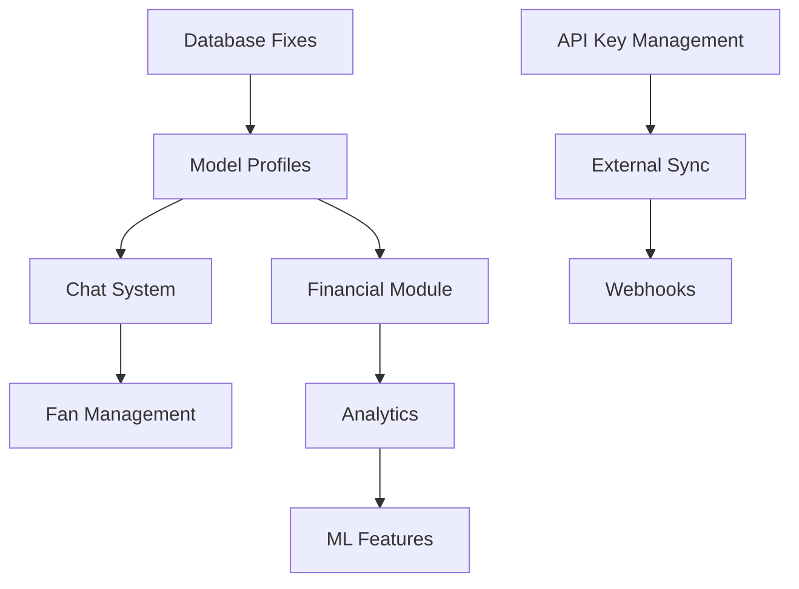

# AgencyDark Implementation TODO List

This document tracks all pending implementation tasks organized by phases and priorities. Last updated: 2025-08-01

## Overview

The implementation is divided into three main phases:
- **Phase 1**: Foundation Fixes (Weeks 1-2)
- **Phase 2**: Core Features (Weeks 3-4)
- **Phase 3**: Integration Layer (Weeks 5-6)

## Quick Links

- [Database & Foundation Tasks](./TODO_DATABASE_FIXES.md)
- [Core Features Implementation](./TODO_CORE_FEATURES.md)
- [Integration Layer Tasks](./TODO_INTEGRATION_LAYER.md)

## Phase Summary

### Phase 1: Foundation Fixes
Focus on critical infrastructure issues that block other features.

**Key Areas:**
- Database migration consistency
- Model profile system implementation
- Error handling improvements
- Performance optimizations

**Status:** 0/12 tasks completed

### Phase 2: Core Features
Implement essential business logic and user-facing features.

**Key Areas:**
- Chat system with real-time messaging
- Financial module completion
- User management enhancements
- UI components

**Status:** 0/12 tasks completed

### Phase 3: Integration Layer
Build external integration capabilities and advanced features.

**Key Areas:**
- API key management system
- External API sync framework
- Webhook processing infrastructure
- Audit logging

**Status:** 0/12 tasks completed

## Priority Matrix

| Priority | Description | Count |
|----------|-------------|-------|
| 🔴 High | Blocking other features or critical bugs | 24 |
| 🟡 Medium | Important but not blocking | 10 |
| 🟢 Low | Nice to have, can be deferred | 2 |

## Dependencies

## Progress Tracking

### Week 1-2: Foundation
- [ ] Complete all database fixes
- [ ] Implement model profile system
- [ ] Fix critical errors

### Week 3-4: Core Features
- [ ] Deploy chat system
- [ ] Complete financial operations
- [ ] Enhance user management

### Week 5-6: Integration
- [ ] API key management live
- [ ] Sync framework operational
- [ ] Webhook system deployed

## Success Metrics

- All TypeScript errors remain at 0
- API response time < 100ms (P95)
- Test coverage > 80%
- No critical security vulnerabilities

## Notes

- Always run tests before marking tasks complete
- Update this document when tasks are completed
- Create PRs for each major feature
- Document API changes in swagger