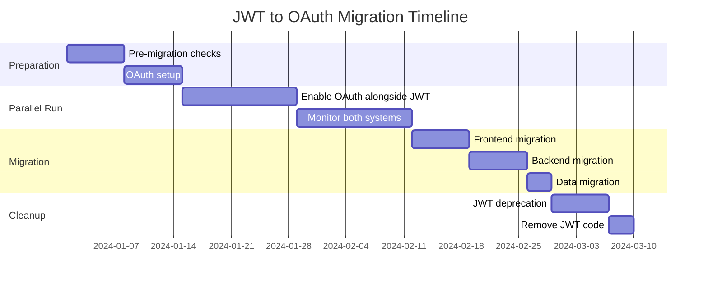

# JWT to OAuth 2.0 Migration Guide

## Overview
This guide provides a comprehensive roadmap for migrating from JWT-based authentication to OAuth 2.0 in the Agency Dark platform. The migration is designed to be gradual and backward-compatible to ensure zero downtime.

## Table of Contents
- [Migration Overview](#migration-overview)
- [Pre-Migration Checklist](#pre-migration-checklist)
- [Phase 1: Parallel Authentication](#phase-1-parallel-authentication)
- [Phase 2: Frontend Migration](#phase-2-frontend-migration)
- [Phase 3: Backend Migration](#phase-3-backend-migration)
- [Phase 4: Data Migration](#phase-4-data-migration)
- [Phase 5: Deprecation](#phase-5-deprecation)
- [Rollback Plan](#rollback-plan)
- [Testing Strategy](#testing-strategy)
- [Monitoring](#monitoring)

---

## Migration Overview

### Why Migrate to OAuth 2.0?

| Aspect | JWT | OAuth 2.0 |
|--------|-----|-----------|
| **Token Revocation** | Difficult without blacklist | Native support via introspection |
| **Fine-grained Permissions** | Limited to token payload | Scope-based authorization |
| **Third-party Integration** | Custom implementation | Industry standard |
| **Token Refresh** | Manual implementation | Built-in refresh flow |
| **Multi-tenant Support** | Custom claims | Native agency context |
| **Security** | Stateless but rigid | Flexible security policies |

### Migration Timeline



---

## Pre-Migration Checklist

### Technical Requirements

```markdown
## Pre-Migration Checklist

### Infrastructure
- [ ] OAuth authorization server deployed
- [ ] Database migrations prepared
- [ ] Redis cache configured
- [ ] Load balancer updated
- [ ] SSL certificates valid

### OAuth Configuration
- [ ] OAuth clients registered
- [ ] Scopes defined
- [ ] PKCE enabled for public clients
- [ ] Token expiration configured
- [ ] Refresh token rotation enabled

### Monitoring
- [ ] Metrics collection configured
- [ ] Alert rules defined
- [ ] Dashboards created
- [ ] Log aggregation ready

### Documentation
- [ ] Migration guide reviewed
- [ ] API documentation updated
- [ ] Team training completed
- [ ] Support team briefed

### Backup & Recovery
- [ ] Database backup created
- [ ] Rollback scripts prepared
- [ ] Recovery plan documented
- [ ] Test environment ready
```

---

## Phase 1: Parallel Authentication

### Enable Both Authentication Methods

```python
# backend/core/auth/dual_auth.py
from typing import Optional, Union
from fastapi import HTTPException, Security, Depends
from fastapi.security import HTTPBearer, HTTPAuthorizationCredentials
import jwt

class DualAuthValidator:
    """
    Support both JWT and OAuth during migration
    """
    
    def __init__(self, jwt_secret: str, oauth_validator: OAuthValidator):
        self.jwt_secret = jwt_secret
        self.oauth_validator = oauth_validator
        self.security = HTTPBearer()
    
    async def validate_token(
        self,
        credentials: HTTPAuthorizationCredentials = Security(HTTPBearer())
    ) -> dict:
        """Validate either JWT or OAuth token"""
        token = credentials.credentials
        
        # Try OAuth first (preferred)
        try:
            oauth_result = await self.oauth_validator.validate_token(token)
            if oauth_result and oauth_result.get("active"):
                return {
                    "type": "oauth",
                    "user_id": oauth_result.get("sub"),
                    "scopes": oauth_result.get("scope", "").split(),
                    "data": oauth_result
                }
        except:
            pass
        
        # Fall back to JWT
        try:
            jwt_payload = jwt.decode(
                token,
                self.jwt_secret,
                algorithms=["HS256"]
            )
            
            # Check JWT expiration
            if jwt_payload.get("exp", 0) < time.time():
                raise HTTPException(401, "Token expired")
            
            return {
                "type": "jwt",
                "user_id": jwt_payload.get("user_id"),
                "scopes": jwt_payload.get("permissions", []),
                "data": jwt_payload
            }
        except jwt.PyJWTError:
            pass
        
        raise HTTPException(401, "Invalid token")

# Usage in FastAPI
dual_auth = DualAuthValidator(
    jwt_secret=settings.JWT_SECRET,
    oauth_validator=oauth_validator
)

@app.get("/api/protected")
async def protected_endpoint(
    auth_info: dict = Depends(dual_auth.validate_token)
):
    # Log which auth method was used
    logger.info(f"Auth type: {auth_info['type']}, User: {auth_info['user_id']}")
    
    return {
        "message": "Access granted",
        "auth_type": auth_info["type"],
        "user": auth_info["user_id"]
    }
```

### Feature Flag for Gradual Rollout

```python
# backend/core/feature_flags.py
from typing import Dict, Any
import redis

class FeatureFlags:
    def __init__(self, redis_client: redis.Redis):
        self.redis = redis_client
    
    def is_oauth_enabled_for_user(self, user_id: str) -> bool:
        """Check if OAuth is enabled for specific user"""
        # Check user-specific flag
        if self.redis.sismember("oauth:enabled_users", user_id):
            return True
        
        # Check percentage rollout
        rollout_percentage = int(self.redis.get("oauth:rollout_percentage") or 0)
        if rollout_percentage > 0:
            # Use consistent hashing for stable assignment
            import hashlib
            user_hash = int(hashlib.md5(user_id.encode()).hexdigest(), 16)
            return (user_hash % 100) < rollout_percentage
        
        return False
    
    def enable_oauth_for_user(self, user_id: str):
        """Enable OAuth for specific user"""
        self.redis.sadd("oauth:enabled_users", user_id)
    
    def set_oauth_rollout_percentage(self, percentage: int):
        """Set OAuth rollout percentage (0-100)"""
        self.redis.set("oauth:rollout_percentage", min(100, max(0, percentage)))

# Migration endpoint
@app.post("/api/auth/migrate-to-oauth")
async def migrate_to_oauth(
    current_user: User = Depends(get_current_user),
    flags: FeatureFlags = Depends(get_feature_flags)
):
    """Allow users to opt-in to OAuth"""
    if flags.is_oauth_enabled_for_user(current_user.id):
        return {"status": "already_migrated"}
    
    # Create OAuth tokens from existing session
    oauth_tokens = await create_oauth_tokens_for_user(current_user)
    
    # Enable OAuth for user
    flags.enable_oauth_for_user(current_user.id)
    
    return {
        "status": "migrated",
        "access_token": oauth_tokens["access_token"],
        "refresh_token": oauth_tokens["refresh_token"]
    }
```

---

## Phase 2: Frontend Migration

### Update Authentication Service

```typescript
// frontend/src/services/auth/migrationAuthService.ts
export class MigrationAuthService {
    private jwtService: JWTAuthService;
    private oauthService: OAuthService;
    private migrationStatus: 'jwt' | 'oauth' | 'dual' = 'dual';
    
    constructor() {
        this.jwtService = new JWTAuthService();
        this.oauthService = new OAuthService(oauthConfig);
        this.checkMigrationStatus();
    }
    
    private async checkMigrationStatus(): Promise<void> {
        try {
            const response = await fetch('/api/auth/migration-status');
            const data = await response.json();
            this.migrationStatus = data.status;
            
            // Store preference
            localStorage.setItem('auth_migration_status', this.migrationStatus);
        } catch {
            // Default to dual mode if check fails
            this.migrationStatus = 'dual';
        }
    }
    
    public async login(email: string, password: string): Promise<AuthTokens> {
        if (this.migrationStatus === 'oauth') {
            // Use OAuth flow
            return this.oauthService.initiateAuthFlow();
        } else if (this.migrationStatus === 'jwt') {
            // Use JWT flow
            return this.jwtService.login(email, password);
        } else {
            // Dual mode - try OAuth first, fall back to JWT
            try {
                // Check if user is OAuth-enabled
                const checkResponse = await fetch('/api/auth/check-oauth-status', {
                    method: 'POST',
                    body: JSON.stringify({ email }),
                    headers: { 'Content-Type': 'application/json' }
                });
                
                const { oauth_enabled } = await checkResponse.json();
                
                if (oauth_enabled) {
                    return this.oauthService.initiateAuthFlow();
                } else {
                    // Use JWT but prompt for migration
                    const tokens = await this.jwtService.login(email, password);
                    this.promptMigration();
                    return tokens;
                }
            } catch {
                // Fall back to JWT on error
                return this.jwtService.login(email, password);
            }
        }
    }
    
    private promptMigration(): void {
        // Show non-intrusive migration prompt
        setTimeout(() => {
            this.showMigrationBanner();
        }, 5000);
    }
    
    private showMigrationBanner(): void {
        const banner = document.createElement('div');
        banner.className = 'migration-banner';
        banner.innerHTML = `
            <div class="migration-content">
                <p>🔄 Enhanced security is available for your account!</p>
                <button onclick="migrateToOAuth()">Upgrade Now</button>
                <button onclick="dismissBanner()">Later</button>
            </div>
        `;
        document.body.appendChild(banner);
    }
    
    public async migrateCurrentSession(): Promise<void> {
        // Migrate current JWT session to OAuth
        const currentToken = this.jwtService.getToken();
        
        if (!currentToken) {
            throw new Error('No active session to migrate');
        }
        
        const response = await fetch('/api/auth/migrate-to-oauth', {
            method: 'POST',
            headers: {
                'Authorization': `Bearer ${currentToken}`
            }
        });
        
        if (!response.ok) {
            throw new Error('Migration failed');
        }
        
        const oauthTokens = await response.json();
        
        // Store OAuth tokens
        this.oauthService.setTokens(oauthTokens);
        
        // Clear JWT tokens
        this.jwtService.clearTokens();
        
        // Update migration status
        this.migrationStatus = 'oauth';
        localStorage.setItem('auth_migration_status', 'oauth');
        
        // Reload to apply changes
        window.location.reload();
    }
}
```

### Update API Client

```typescript
// frontend/src/services/api/dualApiClient.ts
import axios, { AxiosInstance, AxiosRequestConfig } from 'axios';

export class DualApiClient {
    private client: AxiosInstance;
    private authService: MigrationAuthService;
    
    constructor(authService: MigrationAuthService) {
        this.authService = authService;
        this.client = axios.create({
            baseURL: process.env.REACT_APP_API_URL
        });
        
        this.setupInterceptors();
    }
    
    private setupInterceptors(): void {
        // Request interceptor
        this.client.interceptors.request.use(
            async (config) => {
                // Get token from appropriate service
                const token = await this.authService.getActiveToken();
                
                if (token) {
                    config.headers.Authorization = `Bearer ${token}`;
                    
                    // Add migration header if in dual mode
                    const migrationStatus = this.authService.getMigrationStatus();
                    if (migrationStatus === 'dual') {
                        config.headers['X-Auth-Migration'] = 'dual';
                    }
                }
                
                return config;
            },
            (error) => Promise.reject(error)
        );
        
        // Response interceptor
        this.client.interceptors.response.use(
            (response) => {
                // Check for migration hints in response
                if (response.headers['x-auth-migration-available']) {
                    this.authService.setMigrationAvailable(true);
                }
                
                return response;
            },
            async (error) => {
                if (error.response?.status === 401) {
                    // Try to refresh token
                    try {
                        await this.authService.refreshToken();
                        
                        // Retry original request
                        return this.client(error.config);
                    } catch {
                        // Refresh failed, redirect to login
                        this.authService.logout();
                        window.location.href = '/login';
                    }
                }
                
                return Promise.reject(error);
            }
        );
    }
}
```

---

## Phase 3: Backend Migration

### Update User Model

```python
# backend/models/user.py
from sqlalchemy import Column, String, Boolean, DateTime, Enum
from enum import Enum as PyEnum

class AuthType(PyEnum):
    JWT = "jwt"
    OAUTH = "oauth"
    DUAL = "dual"

class User(Base):
    __tablename__ = "users"
    
    id = Column(UUID, primary_key=True)
    email = Column(String, unique=True, nullable=False)
    
    # Migration fields
    auth_type = Column(
        Enum(AuthType),
        default=AuthType.JWT,
        nullable=False
    )
    oauth_migrated_at = Column(DateTime, nullable=True)
    jwt_deprecated_at = Column(DateTime, nullable=True)
    
    # OAuth fields
    oauth_sub = Column(String, unique=True, nullable=True)
    oauth_provider = Column(String, nullable=True)
    
    def should_use_oauth(self) -> bool:
        """Determine if user should use OAuth"""
        return self.auth_type in [AuthType.OAUTH, AuthType.DUAL]
    
    def can_use_jwt(self) -> bool:
        """Check if JWT is still allowed"""
        if self.jwt_deprecated_at:
            return datetime.utcnow() < self.jwt_deprecated_at
        return self.auth_type in [AuthType.JWT, AuthType.DUAL]
```

### Migration Scripts

```python
# backend/migrations/migrate_users_to_oauth.py
import asyncio
from typing import List, Optional
from datetime import datetime, timedelta
import logging

logger = logging.getLogger(__name__)

class UserMigrationService:
    def __init__(self, db, oauth_service, jwt_service):
        self.db = db
        self.oauth_service = oauth_service
        self.jwt_service = jwt_service
    
    async def migrate_users_batch(
        self,
        user_ids: List[str],
        dry_run: bool = True
    ) -> dict:
        """Migrate a batch of users from JWT to OAuth"""
        results = {
            "total": len(user_ids),
            "migrated": 0,
            "failed": 0,
            "skipped": 0,
            "errors": []
        }
        
        for user_id in user_ids:
            try:
                result = await self.migrate_single_user(user_id, dry_run)
                
                if result["status"] == "migrated":
                    results["migrated"] += 1
                elif result["status"] == "skipped":
                    results["skipped"] += 1
                else:
                    results["failed"] += 1
                    results["errors"].append({
                        "user_id": user_id,
                        "error": result.get("error")
                    })
                    
            except Exception as e:
                logger.error(f"Failed to migrate user {user_id}: {e}")
                results["failed"] += 1
                results["errors"].append({
                    "user_id": user_id,
                    "error": str(e)
                })
        
        return results
    
    async def migrate_single_user(
        self,
        user_id: str,
        dry_run: bool = True
    ) -> dict:
        """Migrate single user from JWT to OAuth"""
        
        # Get user
        user = await self.db.fetch_one(
            "SELECT * FROM users WHERE id = $1",
            user_id
        )
        
        if not user:
            return {"status": "error", "error": "User not found"}
        
        # Check if already migrated
        if user["auth_type"] == "oauth":
            return {"status": "skipped", "reason": "Already migrated"}
        
        if dry_run:
            logger.info(f"[DRY RUN] Would migrate user {user_id}")
            return {"status": "dry_run"}
        
        # Create OAuth identity
        oauth_sub = f"user:{user_id}"
        
        # Create OAuth client for user (if using dynamic registration)
        client_id = f"user-{user_id}"
        client_secret = generate_client_secret()
        
        await self.oauth_service.register_client({
            "client_id": client_id,
            "client_secret": client_secret,
            "client_name": f"User {user['email']}",
            "grant_types": ["authorization_code", "refresh_token"],
            "redirect_uris": [f"{BASE_URL}/auth/callback"],
            "scopes": self.determine_user_scopes(user)
        })
        
        # Update user record
        await self.db.execute(
            """
            UPDATE users 
            SET auth_type = $1,
                oauth_sub = $2,
                oauth_migrated_at = $3,
                jwt_deprecated_at = $4
            WHERE id = $5
            """,
            "dual",  # Start with dual mode
            oauth_sub,
            datetime.utcnow(),
            datetime.utcnow() + timedelta(days=30),  # JWT valid for 30 more days
            user_id
        )
        
        # Create initial OAuth tokens if user has active session
        active_sessions = await self.get_active_jwt_sessions(user_id)
        for session in active_sessions:
            await self.convert_jwt_session_to_oauth(session)
        
        # Send migration notification
        await self.send_migration_notification(user)
        
        logger.info(f"Successfully migrated user {user_id} to OAuth")
        
        return {
            "status": "migrated",
            "oauth_sub": oauth_sub,
            "client_id": client_id
        }
    
    def determine_user_scopes(self, user: dict) -> List[str]:
        """Determine OAuth scopes based on user's current permissions"""
        scopes = ["openid", "email", "profile"]
        
        # Map role to scopes
        role_scopes = {
            "admin": ["admin", "read:all", "write:all", "delete:all"],
            "manager": ["read:campaigns", "write:campaigns", "read:analytics"],
            "user": ["read:own", "write:own"]
        }
        
        if user.get("role") in role_scopes:
            scopes.extend(role_scopes[user["role"]])
        
        # Map specific permissions
        permissions = user.get("permissions", [])
        for permission in permissions:
            # Convert permission format
            # "campaigns.read" -> "read:campaigns"
            if "." in permission:
                resource, action = permission.split(".")
                scopes.append(f"{action}:{resource}")
        
        return list(set(scopes))  # Remove duplicates
    
    async def convert_jwt_session_to_oauth(self, session: dict) -> dict:
        """Convert active JWT session to OAuth tokens"""
        # Decode JWT to get expiration
        jwt_payload = self.jwt_service.decode_token(session["token"])
        
        # Create OAuth tokens with same expiration
        oauth_tokens = await self.oauth_service.create_tokens({
            "sub": session["user_id"],
            "scopes": self.determine_user_scopes(session["user"]),
            "expires_in": jwt_payload["exp"] - time.time()
        })
        
        # Store token mapping for rollback
        await self.db.execute(
            """
            INSERT INTO token_migrations 
            (jwt_token_hash, oauth_token_id, user_id, created_at)
            VALUES ($1, $2, $3, $4)
            """,
            hash_token(session["token"]),
            oauth_tokens["jti"],
            session["user_id"],
            datetime.utcnow()
        )
        
        return oauth_tokens

# CLI Command
import click

@click.command()
@click.option('--batch-size', default=100, help='Number of users per batch')
@click.option('--dry-run', is_flag=True, help='Simulate migration without changes')
@click.option('--user-id', help='Migrate specific user')
@click.option('--percentage', type=int, help='Migrate percentage of users')
def migrate_users(batch_size, dry_run, user_id, percentage):
    """Migrate users from JWT to OAuth"""
    
    migration_service = UserMigrationService(db, oauth_service, jwt_service)
    
    if user_id:
        # Migrate single user
        result = asyncio.run(
            migration_service.migrate_single_user(user_id, dry_run)
        )
        print(f"Migration result: {result}")
        
    elif percentage:
        # Migrate percentage of users
        total_users = asyncio.run(
            db.fetch_val("SELECT COUNT(*) FROM users WHERE auth_type = 'jwt'")
        )
        
        users_to_migrate = int(total_users * percentage / 100)
        
        user_ids = asyncio.run(
            db.fetch_all(
                """
                SELECT id FROM users 
                WHERE auth_type = 'jwt'
                ORDER BY created_at
                LIMIT $1
                """,
                users_to_migrate
            )
        )
        
        for i in range(0, len(user_ids), batch_size):
            batch = user_ids[i:i + batch_size]
            result = asyncio.run(
                migration_service.migrate_users_batch(batch, dry_run)
            )
            print(f"Batch {i//batch_size + 1}: {result}")
            
    else:
        # Migrate all users
        user_ids = asyncio.run(
            db.fetch_all("SELECT id FROM users WHERE auth_type = 'jwt'")
        )
        
        for i in range(0, len(user_ids), batch_size):
            batch = user_ids[i:i + batch_size]
            result = asyncio.run(
                migration_service.migrate_users_batch(batch, dry_run)
            )
            print(f"Batch {i//batch_size + 1}: {result}")

if __name__ == "__main__":
    migrate_users()
```

---

## Phase 4: Data Migration

### Token Migration Strategy

```python
# backend/migrations/token_migration.py
class TokenMigrator:
    """Migrate existing JWT tokens to OAuth tokens"""
    
    async def migrate_active_tokens(self):
        """Migrate all active JWT tokens to OAuth"""
        
        # Get all active JWT tokens from cache/database
        active_tokens = await self.get_active_jwt_tokens()
        
        migration_results = []
        
        for jwt_token in active_tokens:
            try:
                # Decode JWT
                jwt_payload = jwt.decode(
                    jwt_token["token"],
                    self.jwt_secret,
                    algorithms=["HS256"]
                )
                
                # Create equivalent OAuth token
                oauth_token = await self.create_oauth_from_jwt(jwt_payload)
                
                # Store mapping
                await self.store_token_mapping(jwt_token, oauth_token)
                
                migration_results.append({
                    "jwt_jti": jwt_payload.get("jti"),
                    "oauth_jti": oauth_token["jti"],
                    "user_id": jwt_payload.get("user_id"),
                    "status": "success"
                })
                
            except Exception as e:
                logger.error(f"Failed to migrate token: {e}")
                migration_results.append({
                    "jwt_jti": jwt_token.get("jti"),
                    "status": "failed",
                    "error": str(e)
                })
        
        return migration_results
    
    async def create_oauth_from_jwt(self, jwt_payload: dict) -> dict:
        """Create OAuth token from JWT payload"""
        
        # Map JWT claims to OAuth token
        oauth_token = {
            "access_token": generate_access_token(),
            "token_type": "Bearer",
            "expires_in": jwt_payload["exp"] - int(time.time()),
            "scope": " ".join(self.map_permissions_to_scopes(
                jwt_payload.get("permissions", [])
            )),
            "sub": f"user:{jwt_payload['user_id']}",
            "iat": int(time.time()),
            "exp": jwt_payload["exp"],
            "jti": str(uuid.uuid4()),
            "agency_id": jwt_payload.get("agency_id")
        }
        
        # Store in OAuth token store
        await self.oauth_store.store_token(oauth_token)
        
        return oauth_token
    
    def map_permissions_to_scopes(self, permissions: List[str]) -> List[str]:
        """Map JWT permissions to OAuth scopes"""
        scope_mapping = {
            "campaigns.read": "read:campaigns",
            "campaigns.write": "write:campaigns",
            "campaigns.delete": "delete:campaigns",
            "users.read": "read:users",
            "users.write": "write:users",
            "admin": "admin",
            "analytics.read": "read:analytics"
        }
        
        scopes = ["openid", "email", "profile"]
        
        for permission in permissions:
            if permission in scope_mapping:
                scopes.append(scope_mapping[permission])
            else:
                # Direct mapping for unknown permissions
                scopes.append(permission.replace(".", ":"))
        
        return scopes
```

### Session Migration

```python
# backend/migrations/session_migration.py
class SessionMigrator:
    """Migrate user sessions from JWT to OAuth"""
    
    async def migrate_user_sessions(self, user_id: str):
        """Migrate all sessions for a user"""
        
        # Get all active sessions
        sessions = await self.redis.smembers(f"user:sessions:{user_id}")
        
        for session_id in sessions:
            session_data = await self.redis.hgetall(f"session:{session_id}")
            
            if session_data.get("auth_type") == "jwt":
                # Create OAuth session
                oauth_session = await self.create_oauth_session(
                    user_id,
                    session_data
                )
                
                # Update session data
                await self.redis.hset(
                    f"session:{session_id}",
                    mapping={
                        **session_data,
                        "auth_type": "oauth",
                        "oauth_token": oauth_session["access_token"],
                        "migration_timestamp": int(time.time())
                    }
                )
                
                logger.info(f"Migrated session {session_id} for user {user_id}")
```

---

## Phase 5: Deprecation

### JWT Deprecation Timeline

```python
# backend/core/auth/deprecation.py
from datetime import datetime, timedelta
from enum import Enum

class DeprecationPhase(Enum):
    ACTIVE = "active"           # JWT fully supported
    DEPRECATED = "deprecated"   # JWT works with warnings
    SUNSET = "sunset"          # JWT read-only
    DISABLED = "disabled"      # JWT completely disabled

class JWTDeprecationManager:
    def __init__(self):
        self.phases = {
            DeprecationPhase.ACTIVE: datetime(2024, 1, 1),
            DeprecationPhase.DEPRECATED: datetime(2024, 2, 1),
            DeprecationPhase.SUNSET: datetime(2024, 3, 1),
            DeprecationPhase.DISABLED: datetime(2024, 4, 1)
        }
    
    def get_current_phase(self) -> DeprecationPhase:
        """Get current deprecation phase"""
        now = datetime.utcnow()
        
        for phase in reversed(list(DeprecationPhase)):
            if now >= self.phases[phase]:
                return phase
        
        return DeprecationPhase.ACTIVE
    
    def validate_jwt_usage(self, user_id: str) -> dict:
        """Check if JWT can be used"""
        phase = self.get_current_phase()
        
        if phase == DeprecationPhase.DISABLED:
            return {
                "allowed": False,
                "message": "JWT authentication is no longer supported",
                "action": "migrate_required"
            }
        
        if phase == DeprecationPhase.SUNSET:
            return {
                "allowed": True,
                "message": "JWT will be disabled soon. Please migrate to OAuth.",
                "action": "migrate_urgent",
                "deadline": self.phases[DeprecationPhase.DISABLED]
            }
        
        if phase == DeprecationPhase.DEPRECATED:
            return {
                "allowed": True,
                "message": "JWT is deprecated. Consider migrating to OAuth.",
                "action": "migrate_recommended"
            }
        
        return {
            "allowed": True,
            "message": "JWT is active",
            "action": None
        }

# Middleware to handle deprecation
@app.middleware("http")
async def jwt_deprecation_middleware(request: Request, call_next):
    response = await call_next(request)
    
    # Check if JWT was used
    if hasattr(request.state, "auth_type") and request.state.auth_type == "jwt":
        deprecation_mgr = JWTDeprecationManager()
        status = deprecation_mgr.validate_jwt_usage(request.state.user_id)
        
        # Add deprecation headers
        if status["action"]:
            response.headers["X-Auth-Deprecation"] = status["action"]
            response.headers["X-Auth-Deprecation-Message"] = status["message"]
            
            if "deadline" in status:
                response.headers["X-Auth-Deprecation-Deadline"] = \
                    status["deadline"].isoformat()
    
    return response
```

### Cleanup Scripts

```bash
#!/bin/bash
# cleanup_jwt.sh

echo "JWT Cleanup Script"
echo "=================="

# Check current phase
PHASE=$(python -c "from deprecation import JWTDeprecationManager; print(JWTDeprecationManager().get_current_phase().value)")

if [ "$PHASE" != "disabled" ]; then
    echo "Warning: JWT is not yet disabled (current phase: $PHASE)"
    read -p "Continue anyway? (y/n) " -n 1 -r
    echo
    if [[ ! $REPLY =~ ^[Yy]$ ]]; then
        exit 1
    fi
fi

# Backup JWT-related code
echo "Creating backup..."
tar -czf jwt_backup_$(date +%Y%m%d).tar.gz \
    backend/core/auth/jwt_*.py \
    frontend/src/services/jwt*.ts

# Remove JWT endpoints
echo "Removing JWT endpoints..."
rm -f backend/api/v1/endpoints/jwt_auth.py

# Remove JWT dependencies
echo "Updating dependencies..."
pip uninstall -y pyjwt
npm uninstall jsonwebtoken

# Update configuration
echo "Updating configuration..."
sed -i '/JWT_SECRET/d' .env
sed -i '/JWT_ALGORITHM/d' .env

echo "Cleanup complete!"
```

---

## Rollback Plan

### Automated Rollback

```python
# backend/core/auth/rollback.py
class AuthRollbackManager:
    async def rollback_user_to_jwt(self, user_id: str, reason: str):
        """Rollback single user from OAuth to JWT"""
        
        try:
            # Get user
            user = await self.db.fetch_one(
                "SELECT * FROM users WHERE id = $1",
                user_id
            )
            
            if user["auth_type"] == "jwt":
                return {"status": "already_jwt"}
            
            # Restore JWT tokens from backup
            jwt_tokens = await self.restore_jwt_tokens(user_id)
            
            # Update user auth type
            await self.db.execute(
                """
                UPDATE users 
                SET auth_type = 'jwt',
                    rollback_at = $1,
                    rollback_reason = $2
                WHERE id = $3
                """,
                datetime.utcnow(),
                reason,
                user_id
            )
            
            # Revoke OAuth tokens
            await self.revoke_oauth_tokens(user_id)
            
            # Clear OAuth sessions
            await self.clear_oauth_sessions(user_id)
            
            # Log rollback
            logger.warning(f"Rolled back user {user_id} to JWT: {reason}")
            
            return {
                "status": "rolled_back",
                "jwt_tokens": jwt_tokens
            }
            
        except Exception as e:
            logger.error(f"Rollback failed for user {user_id}: {e}")
            raise

# Rollback API endpoint
@app.post("/api/admin/auth/rollback/{user_id}")
async def rollback_user_auth(
    user_id: str,
    reason: str,
    current_admin: User = Depends(require_admin)
):
    """Rollback user from OAuth to JWT"""
    
    rollback_mgr = AuthRollbackManager()
    result = await rollback_mgr.rollback_user_to_jwt(user_id, reason)
    
    # Send notification to user
    await send_rollback_notification(user_id, reason)
    
    return result
```

---

## Testing Strategy

### Migration Testing

```python
# tests/test_migration.py
import pytest
from datetime import datetime, timedelta

@pytest.mark.asyncio
async def test_jwt_to_oauth_migration():
    """Test complete migration flow"""
    
    # Create test user with JWT
    user = await create_test_user()
    jwt_token = create_jwt_token(user.id)
    
    # Initiate migration
    migration_service = UserMigrationService(db, oauth_service, jwt_service)
    result = await migration_service.migrate_single_user(user.id, dry_run=False)
    
    assert result["status"] == "migrated"
    assert result["oauth_sub"] == f"user:{user.id}"
    
    # Verify dual auth works
    dual_auth = DualAuthValidator(jwt_secret, oauth_validator)
    
    # JWT should still work
    jwt_result = await dual_auth.validate_token(jwt_token)
    assert jwt_result["type"] == "jwt"
    
    # OAuth should work
    oauth_token = await get_oauth_token_for_user(user.id)
    oauth_result = await dual_auth.validate_token(oauth_token)
    assert oauth_result["type"] == "oauth"

@pytest.mark.asyncio
async def test_rollback():
    """Test rollback from OAuth to JWT"""
    
    # Create migrated user
    user = await create_test_user(auth_type="oauth")
    
    # Perform rollback
    rollback_mgr = AuthRollbackManager()
    result = await rollback_mgr.rollback_user_to_jwt(
        user.id,
        "Testing rollback"
    )
    
    assert result["status"] == "rolled_back"
    
    # Verify JWT works
    jwt_token = result["jwt_tokens"]["access_token"]
    validated = jwt.decode(jwt_token, jwt_secret, algorithms=["HS256"])
    assert validated["user_id"] == user.id

@pytest.mark.asyncio
async def test_deprecation_phases():
    """Test JWT deprecation phases"""
    
    deprecation_mgr = JWTDeprecationManager()
    
    # Test each phase
    with freeze_time("2024-01-15"):
        assert deprecation_mgr.get_current_phase() == DeprecationPhase.ACTIVE
        status = deprecation_mgr.validate_jwt_usage("user-1")
        assert status["allowed"] is True
    
    with freeze_time("2024-02-15"):
        assert deprecation_mgr.get_current_phase() == DeprecationPhase.DEPRECATED
        status = deprecation_mgr.validate_jwt_usage("user-1")
        assert status["allowed"] is True
        assert "deprecated" in status["message"]
    
    with freeze_time("2024-04-15"):
        assert deprecation_mgr.get_current_phase() == DeprecationPhase.DISABLED
        status = deprecation_mgr.validate_jwt_usage("user-1")
        assert status["allowed"] is False
```

---

## Monitoring

### Migration Metrics

```python
# backend/monitoring/migration_metrics.py
from prometheus_client import Counter, Gauge, Histogram

# Define metrics
migration_total = Counter(
    'auth_migration_total',
    'Total number of auth migrations',
    ['status']
)

migration_duration = Histogram(
    'auth_migration_duration_seconds',
    'Time taken to migrate user'
)

auth_type_gauge = Gauge(
    'auth_type_users',
    'Number of users by auth type',
    ['type']
)

dual_auth_requests = Counter(
    'dual_auth_requests_total',
    'Requests processed by dual auth',
    ['auth_type']
)

rollback_total = Counter(
    'auth_rollback_total',
    'Total number of rollbacks'
)

# Update metrics during migration
@migration_duration.time()
async def migrate_with_metrics(user_id: str):
    try:
        result = await migrate_single_user(user_id)
        migration_total.labels(status='success').inc()
        return result
    except Exception as e:
        migration_total.labels(status='failed').inc()
        raise

# Dashboard queries
"""
Grafana Dashboard Queries:

1. Migration Progress:
   sum(auth_type_users) by (type)

2. Migration Rate:
   rate(auth_migration_total[5m])

3. Auth Type Distribution:
   auth_type_users / sum(auth_type_users)

4. Dual Auth Usage:
   rate(dual_auth_requests_total[5m]) by (auth_type)

5. Rollback Rate:
   rate(auth_rollback_total[1h])
"""
```

### Migration Dashboard

```yaml
# monitoring/dashboards/migration-dashboard.yaml
apiVersion: v1
kind: ConfigMap
metadata:
  name: migration-dashboard
data:
  dashboard.json: |
    {
      "dashboard": {
        "title": "JWT to OAuth Migration",
        "panels": [
          {
            "title": "Migration Progress",
            "type": "graph",
            "targets": [
              {
                "expr": "sum(auth_type_users) by (type)"
              }
            ]
          },
          {
            "title": "Auth Type Distribution",
            "type": "pie",
            "targets": [
              {
                "expr": "auth_type_users"
              }
            ]
          },
          {
            "title": "Migration Success Rate",
            "type": "stat",
            "targets": [
              {
                "expr": "sum(rate(auth_migration_total{status='success'}[1h])) / sum(rate(auth_migration_total[1h]))"
              }
            ]
          },
          {
            "title": "Active Deprecation Phase",
            "type": "text",
            "content": "Current Phase: ${deprecation_phase}"
          }
        ]
      }
    }
```

---

## Best Practices

### 1. Communication Plan
- Announce migration 30 days in advance
- Send weekly reminders
- Provide clear migration instructions
- Offer support channels

### 2. Gradual Rollout
- Start with internal users
- Move to beta users (10%)
- Expand to 50% of users
- Complete migration for all users

### 3. Monitoring
- Track migration progress
- Monitor error rates
- Watch for performance impacts
- Collect user feedback

### 4. Support
- Prepare FAQ documentation
- Train support team
- Set up dedicated migration help
- Provide rollback options

---

## Checklist

```markdown
## Migration Checklist

### Pre-Migration
- [ ] OAuth infrastructure deployed
- [ ] Dual auth system tested
- [ ] Migration scripts prepared
- [ ] Rollback plan tested
- [ ] Monitoring configured
- [ ] Team trained
- [ ] Users notified

### During Migration
- [ ] Enable dual auth
- [ ] Start with test users
- [ ] Monitor metrics
- [ ] Collect feedback
- [ ] Address issues
- [ ] Gradual rollout

### Post-Migration
- [ ] Verify all users migrated
- [ ] Deprecate JWT endpoints
- [ ] Remove JWT code
- [ ] Update documentation
- [ ] Archive JWT artifacts
- [ ] Celebrate success! 🎉
```

---

## Resources

- [OAuth 2.0 Migration Best Practices](https://oauth.net/2/migration/)
- [Agency Dark OAuth Documentation](../api/oauth-endpoints.md)
- [Frontend OAuth Integration](./oauth-frontend-integration.md)
- [Backend OAuth Integration](./oauth-backend-integration.md)