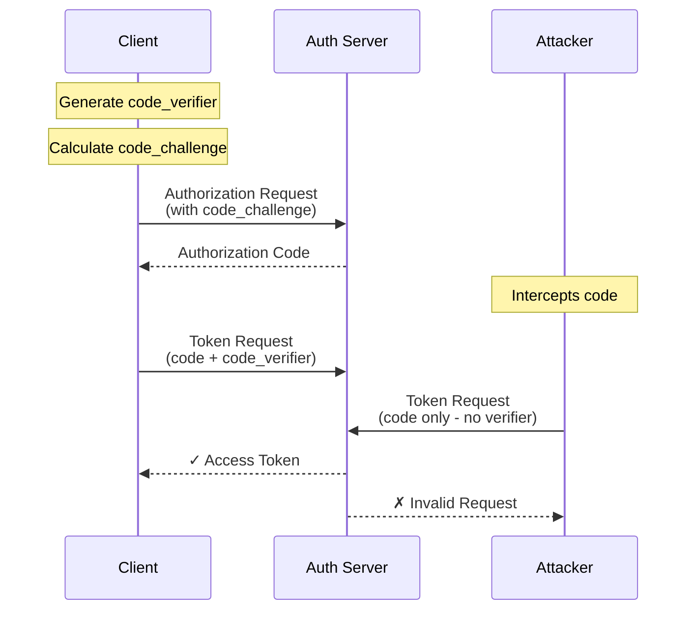

# PKCE (Proof Key for Code Exchange) Implementation Guide

## Overview
PKCE (RFC 7636) is a security extension to OAuth 2.0 that protects authorization codes from interception attacks. Originally designed for public clients (mobile apps, SPAs), PKCE is now recommended for all OAuth clients as a security best practice.

## Table of Contents
- [Why PKCE?](#why-pkce)
- [How PKCE Works](#how-pkce-works)
- [Implementation Steps](#implementation-steps)
- [Frontend Implementation](#frontend-implementation)
- [Backend Implementation](#backend-implementation)
- [Mobile App Implementation](#mobile-app-implementation)
- [Testing PKCE](#testing-pkce)
- [Common Pitfalls](#common-pitfalls)
- [Security Considerations](#security-considerations)

---

## Why PKCE?

### Problems PKCE Solves

1. **Authorization Code Interception**
   - Malicious apps can register the same redirect URI
   - Network attackers can intercept authorization codes
   - App-to-app communication can be compromised

2. **Public Client Vulnerabilities**
   - SPAs cannot securely store client secrets
   - Mobile apps can be reverse-engineered
   - Native apps face inter-app communication risks

3. **Man-in-the-Middle Attacks**
   - Even with HTTPS, local attackers can intercept codes
   - Compromised networks pose risks
   - Browser extensions can access codes

### PKCE Security Flow



---

## How PKCE Works

### Step-by-Step Process

1. **Client generates code verifier**
   - Random string of 43-128 characters
   - High entropy cryptographically secure random

2. **Client creates code challenge**
   - SHA256 hash of code verifier
   - Base64-URL encoded (no padding)

3. **Authorization request includes challenge**
   - `code_challenge` parameter
   - `code_challenge_method=S256`

4. **Server stores challenge with authorization code**

5. **Token exchange includes verifier**
   - Client sends original `code_verifier`
   - Server validates: `SHA256(verifier) == challenge`

6. **Server issues tokens only if valid**

---

## Implementation Steps

### Complete PKCE Implementation

```python
# backend/oauth/pkce.py
import secrets
import hashlib
import base64
from typing import Tuple, Optional
import re

class PKCEValidator:
    """
    PKCE implementation for OAuth 2.0
    """
    
    # RFC 7636 requirements
    MIN_VERIFIER_LENGTH = 43
    MAX_VERIFIER_LENGTH = 128
    VERIFIER_PATTERN = re.compile(r'^[A-Za-z0-9\-._~]+$')
    
    @classmethod
    def generate_pkce_pair(cls) -> Tuple[str, str]:
        """
        Generate PKCE verifier and challenge pair
        
        Returns:
            Tuple of (code_verifier, code_challenge)
        """
        # Generate code verifier
        code_verifier = cls.generate_code_verifier()
        
        # Generate code challenge
        code_challenge = cls.generate_code_challenge(code_verifier)
        
        return code_verifier, code_challenge
    
    @classmethod
    def generate_code_verifier(cls, length: int = 128) -> str:
        """
        Generate cryptographically secure code verifier
        
        Args:
            length: Length of verifier (43-128 characters)
        
        Returns:
            Code verifier string
        """
        if not cls.MIN_VERIFIER_LENGTH <= length <= cls.MAX_VERIFIER_LENGTH:
            raise ValueError(
                f"Verifier length must be {cls.MIN_VERIFIER_LENGTH}-"
                f"{cls.MAX_VERIFIER_LENGTH} characters"
            )
        
        # Use URL-safe characters
        alphabet = 'ABCDEFGHIJKLMNOPQRSTUVWXYZabcdefghijklmnopqrstuvwxyz0123456789-._~'
        
        # Generate random verifier
        verifier = ''.join(
            secrets.choice(alphabet) for _ in range(length)
        )
        
        # Validate verifier
        if not cls.validate_verifier_format(verifier):
            raise ValueError("Generated verifier failed validation")
        
        return verifier
    
    @classmethod
    def generate_code_challenge(cls, code_verifier: str) -> str:
        """
        Generate code challenge from verifier using S256 method
        
        Args:
            code_verifier: The code verifier string
        
        Returns:
            Base64-URL encoded SHA256 hash of verifier
        """
        # Validate verifier
        if not cls.validate_verifier_format(code_verifier):
            raise ValueError("Invalid code verifier format")
        
        # Calculate SHA256 hash
        digest = hashlib.sha256(code_verifier.encode('ascii')).digest()
        
        # Base64-URL encode (no padding)
        challenge = base64.urlsafe_b64encode(digest).decode('ascii')
        challenge = challenge.rstrip('=')  # Remove padding
        
        return challenge
    
    @classmethod
    def validate_verifier_format(cls, verifier: str) -> bool:
        """
        Validate code verifier format per RFC 7636
        
        Args:
            verifier: Code verifier to validate
        
        Returns:
            True if valid, False otherwise
        """
        if not verifier:
            return False
        
        # Check length
        if not cls.MIN_VERIFIER_LENGTH <= len(verifier) <= cls.MAX_VERIFIER_LENGTH:
            return False
        
        # Check character set
        if not cls.VERIFIER_PATTERN.match(verifier):
            return False
        
        return True
    
    @classmethod
    def validate_pkce(
        cls,
        code_verifier: str,
        code_challenge: str,
        method: str = 'S256'
    ) -> bool:
        """
        Validate PKCE verifier against challenge
        
        Args:
            code_verifier: Provided code verifier
            code_challenge: Stored code challenge
            method: Challenge method (only S256 supported)
        
        Returns:
            True if valid, False otherwise
        """
        # Only support S256 (SHA256)
        if method != 'S256':
            return False
        
        # Validate verifier format
        if not cls.validate_verifier_format(code_verifier):
            return False
        
        # Calculate expected challenge
        try:
            expected_challenge = cls.generate_code_challenge(code_verifier)
        except Exception:
            return False
        
        # Constant-time comparison
        return secrets.compare_digest(expected_challenge, code_challenge)
    
    @classmethod
    def extract_pkce_params(cls, request: dict) -> Optional[dict]:
        """
        Extract and validate PKCE parameters from request
        
        Args:
            request: OAuth request parameters
        
        Returns:
            PKCE parameters or None if not present
        """
        # Authorization request
        if 'code_challenge' in request:
            challenge = request.get('code_challenge')
            method = request.get('code_challenge_method', 'plain')
            
            # Reject plain method
            if method == 'plain':
                raise ValueError("Plain method not supported, use S256")
            
            if method != 'S256':
                raise ValueError(f"Unsupported challenge method: {method}")
            
            # Validate challenge format
            if not cls.validate_challenge_format(challenge):
                raise ValueError("Invalid code challenge format")
            
            return {
                'code_challenge': challenge,
                'code_challenge_method': method
            }
        
        # Token request
        elif 'code_verifier' in request:
            verifier = request.get('code_verifier')
            
            # Validate verifier
            if not cls.validate_verifier_format(verifier):
                raise ValueError("Invalid code verifier format")
            
            return {'code_verifier': verifier}
        
        return None
    
    @classmethod
    def validate_challenge_format(cls, challenge: str) -> bool:
        """
        Validate code challenge format
        
        Args:
            challenge: Code challenge to validate
        
        Returns:
            True if valid, False otherwise
        """
        if not challenge:
            return False
        
        # Base64-URL format (no padding)
        pattern = re.compile(r'^[A-Za-z0-9\-_]+$')
        if not pattern.match(challenge):
            return False
        
        # Should be 43 characters (256 bits base64-url encoded)
        if len(challenge) != 43:
            return False
        
        return True

# Usage in authorization endpoint
async def handle_authorization_request(request: AuthorizationRequest):
    """
    Handle authorization request with PKCE
    """
    # Extract PKCE parameters
    pkce_params = PKCEValidator.extract_pkce_params(request.dict())
    
    # Check if PKCE is required
    client = await get_client(request.client_id)
    
    if client['type'] == 'public' and not pkce_params:
        raise OAuth2Error(
            'invalid_request',
            'PKCE is required for public clients'
        )
    
    # Store PKCE challenge with authorization code
    auth_code = generate_authorization_code()
    
    await store_authorization_code(
        code=auth_code,
        client_id=request.client_id,
        user_id=current_user.id,
        redirect_uri=request.redirect_uri,
        scope=request.scope,
        code_challenge=pkce_params.get('code_challenge') if pkce_params else None,
        code_challenge_method=pkce_params.get('code_challenge_method') if pkce_params else None
    )
    
    return auth_code

# Usage in token endpoint
async def handle_token_request(request: TokenRequest):
    """
    Handle token request with PKCE validation
    """
    # Get stored authorization code
    code_data = await get_authorization_code(request.code)
    
    if not code_data:
        raise OAuth2Error('invalid_grant', 'Invalid authorization code')
    
    # Check if PKCE was used
    if code_data.get('code_challenge'):
        # PKCE is required
        if not request.code_verifier:
            raise OAuth2Error(
                'invalid_request',
                'Code verifier required'
            )
        
        # Validate PKCE
        if not PKCEValidator.validate_pkce(
            code_verifier=request.code_verifier,
            code_challenge=code_data['code_challenge'],
            method=code_data.get('code_challenge_method', 'S256')
        ):
            # Log potential attack
            logger.warning(
                f"PKCE validation failed for client {request.client_id}"
            )
            
            # Revoke the code
            await revoke_authorization_code(request.code)
            
            raise OAuth2Error('invalid_grant', 'Invalid code verifier')
    
    # PKCE validation passed, issue tokens
    return await issue_tokens(code_data)
```

---

## Frontend Implementation

### JavaScript/TypeScript Implementation

```typescript
// frontend/src/services/pkce.ts
import { createHash, randomBytes } from 'crypto';

export class PKCEChallenge {
    private static readonly VERIFIER_LENGTH = 128;
    private static readonly CHARSET = 'ABCDEFGHIJKLMNOPQRSTUVWXYZabcdefghijklmnopqrstuvwxyz0123456789-._~';
    
    /**
     * Generate PKCE challenge pair
     */
    public static generate(): { verifier: string; challenge: string } {
        const verifier = this.generateVerifier();
        const challenge = this.generateChallenge(verifier);
        
        return { verifier, challenge };
    }
    
    /**
     * Generate code verifier
     */
    private static generateVerifier(): string {
        const buffer = new Uint8Array(this.VERIFIER_LENGTH);
        
        // Use Web Crypto API for secure random
        if (typeof window !== 'undefined' && window.crypto) {
            window.crypto.getRandomValues(buffer);
        } else {
            // Node.js environment
            const nodeBuffer = randomBytes(this.VERIFIER_LENGTH);
            buffer.set(nodeBuffer);
        }
        
        // Convert to URL-safe string
        return Array.from(buffer)
            .map(byte => this.CHARSET[byte % this.CHARSET.length])
            .join('');
    }
    
    /**
     * Generate code challenge from verifier
     */
    private static generateChallenge(verifier: string): string {
        // Use Web Crypto API if available
        if (typeof window !== 'undefined' && window.crypto && window.crypto.subtle) {
            return this.generateChallengeWeb(verifier);
        } else {
            return this.generateChallengeNode(verifier);
        }
    }
    
    /**
     * Generate challenge using Web Crypto API (browser)
     */
    private static async generateChallengeWeb(verifier: string): Promise<string> {
        const encoder = new TextEncoder();
        const data = encoder.encode(verifier);
        
        const hash = await window.crypto.subtle.digest('SHA-256', data);
        
        // Convert to base64-url
        return this.base64UrlEncode(new Uint8Array(hash));
    }
    
    /**
     * Generate challenge using Node crypto (server/testing)
     */
    private static generateChallengeNode(verifier: string): string {
        const hash = createHash('sha256')
            .update(verifier)
            .digest();
        
        return this.base64UrlEncode(hash);
    }
    
    /**
     * Base64-URL encode without padding
     */
    private static base64UrlEncode(buffer: Uint8Array): string {
        const base64 = btoa(String.fromCharCode(...buffer));
        
        return base64
            .replace(/\+/g, '-')
            .replace(/\//g, '_')
            .replace(/=/g, '');
    }
}

// React Hook for PKCE
import { useState, useEffect } from 'react';

export function usePKCE() {
    const [pkce, setPKCE] = useState<{
        verifier: string;
        challenge: string;
    } | null>(null);
    
    useEffect(() => {
        // Generate PKCE on mount
        const generated = PKCEChallenge.generate();
        setPKCE(generated);
        
        // Store verifier in session storage
        sessionStorage.setItem('pkce_verifier', generated.verifier);
    }, []);
    
    const getStoredVerifier = (): string | null => {
        return sessionStorage.getItem('pkce_verifier');
    };
    
    const clearPKCE = () => {
        sessionStorage.removeItem('pkce_verifier');
        setPKCE(null);
    };
    
    return {
        challenge: pkce?.challenge,
        verifier: pkce?.verifier,
        getStoredVerifier,
        clearPKCE
    };
}

// OAuth Service with PKCE
export class OAuthService {
    private pkce: { verifier: string; challenge: string } | null = null;
    
    public async initiateAuthorization(
        clientId: string,
        redirectUri: string,
        scope: string,
        state: string
    ): Promise<void> {
        // Generate PKCE
        this.pkce = PKCEChallenge.generate();
        
        // Store verifier
        sessionStorage.setItem('oauth_pkce_verifier', this.pkce.verifier);
        sessionStorage.setItem('oauth_state', state);
        
        // Build authorization URL
        const params = new URLSearchParams({
            response_type: 'code',
            client_id: clientId,
            redirect_uri: redirectUri,
            scope: scope,
            state: state,
            code_challenge: this.pkce.challenge,
            code_challenge_method: 'S256'
        });
        
        // Redirect to authorization server
        window.location.href = `${OAUTH_AUTHORIZE_URL}?${params}`;
    }
    
    public async handleCallback(
        code: string,
        state: string
    ): Promise<TokenResponse> {
        // Validate state
        const storedState = sessionStorage.getItem('oauth_state');
        if (state !== storedState) {
            throw new Error('State mismatch - possible CSRF attack');
        }
        
        // Get stored verifier
        const verifier = sessionStorage.getItem('oauth_pkce_verifier');
        if (!verifier) {
            throw new Error('PKCE verifier not found');
        }
        
        // Exchange code for tokens
        const response = await fetch(OAUTH_TOKEN_URL, {
            method: 'POST',
            headers: {
                'Content-Type': 'application/x-www-form-urlencoded'
            },
            body: new URLSearchParams({
                grant_type: 'authorization_code',
                code: code,
                redirect_uri: REDIRECT_URI,
                client_id: CLIENT_ID,
                code_verifier: verifier
            })
        });
        
        if (!response.ok) {
            const error = await response.json();
            throw new Error(error.error_description || 'Token exchange failed');
        }
        
        // Clear PKCE data
        sessionStorage.removeItem('oauth_pkce_verifier');
        sessionStorage.removeItem('oauth_state');
        
        return response.json();
    }
}
```

---

## Backend Implementation

### Authorization Server PKCE Support

```python
# backend/oauth/authorization_server.py
from fastapi import APIRouter, Request, HTTPException
from typing import Optional
import redis
import json

router = APIRouter(prefix="/oauth")

class AuthorizationServer:
    def __init__(self, redis_client: redis.Redis):
        self.redis = redis_client
        self.pkce_validator = PKCEValidator()
    
    async def authorize(
        self,
        client_id: str,
        redirect_uri: str,
        response_type: str,
        scope: str,
        state: Optional[str] = None,
        code_challenge: Optional[str] = None,
        code_challenge_method: Optional[str] = None,
        **kwargs
    ):
        """
        Handle authorization request with PKCE support
        """
        # Validate client
        client = await self.get_client(client_id)
        if not client:
            raise HTTPException(400, "Invalid client")
        
        # Check PKCE requirement
        pkce_required = (
            client['type'] == 'public' or
            client.get('require_pkce', False) or
            self.is_high_risk_environment()
        )
        
        if pkce_required and not code_challenge:
            raise HTTPException(
                400,
                "PKCE is required for this client"
            )
        
        # Validate PKCE parameters if provided
        if code_challenge:
            if code_challenge_method != 'S256':
                raise HTTPException(
                    400,
                    "Only S256 challenge method is supported"
                )
            
            if not self.pkce_validator.validate_challenge_format(code_challenge):
                raise HTTPException(
                    400,
                    "Invalid code challenge format"
                )
        
        # Generate authorization code
        auth_code = self.generate_authorization_code()
        
        # Store code with PKCE challenge
        code_data = {
            'code': auth_code,
            'client_id': client_id,
            'redirect_uri': redirect_uri,
            'scope': scope,
            'user_id': current_user.id,
            'created_at': time.time(),
            'expires_at': time.time() + 600,  # 10 minutes
        }
        
        if code_challenge:
            code_data['code_challenge'] = code_challenge
            code_data['code_challenge_method'] = code_challenge_method
        
        # Store in Redis with expiration
        self.redis.setex(
            f"auth_code:{auth_code}",
            600,
            json.dumps(code_data)
        )
        
        # Log for security monitoring
        logger.info(
            f"Authorization code issued for client {client_id} "
            f"with PKCE: {bool(code_challenge)}"
        )
        
        # Redirect with code
        redirect_url = f"{redirect_uri}?code={auth_code}"
        if state:
            redirect_url += f"&state={state}"
        
        return RedirectResponse(redirect_url)
    
    async def token(
        self,
        grant_type: str,
        code: Optional[str] = None,
        redirect_uri: Optional[str] = None,
        client_id: Optional[str] = None,
        client_secret: Optional[str] = None,
        code_verifier: Optional[str] = None,
        **kwargs
    ):
        """
        Handle token request with PKCE validation
        """
        if grant_type != 'authorization_code':
            raise HTTPException(400, "Unsupported grant type")
        
        # Get authorization code data
        code_key = f"auth_code:{code}"
        code_data = self.redis.get(code_key)
        
        if not code_data:
            raise HTTPException(400, "Invalid or expired authorization code")
        
        code_data = json.loads(code_data)
        
        # Check expiration
        if code_data['expires_at'] < time.time():
            self.redis.delete(code_key)
            raise HTTPException(400, "Authorization code expired")
        
        # Validate client
        if code_data['client_id'] != client_id:
            raise HTTPException(400, "Client mismatch")
        
        # Validate redirect URI
        if code_data['redirect_uri'] != redirect_uri:
            raise HTTPException(400, "Redirect URI mismatch")
        
        # PKCE validation
        if 'code_challenge' in code_data:
            if not code_verifier:
                # PKCE was used in authorization, verifier required
                raise HTTPException(
                    400,
                    "Code verifier required"
                )
            
            # Validate PKCE
            if not self.pkce_validator.validate_pkce(
                code_verifier=code_verifier,
                code_challenge=code_data['code_challenge'],
                method=code_data.get('code_challenge_method', 'S256')
            ):
                # PKCE validation failed - possible attack
                logger.warning(
                    f"PKCE validation failed for client {client_id}, "
                    f"code {code[:8]}..."
                )
                
                # Delete the code immediately
                self.redis.delete(code_key)
                
                # Track failed attempts
                self.track_failed_pkce(client_id)
                
                raise HTTPException(400, "Invalid code verifier")
        
        # Delete code (one-time use)
        self.redis.delete(code_key)
        
        # Issue tokens
        tokens = await self.issue_tokens(
            user_id=code_data['user_id'],
            client_id=client_id,
            scope=code_data['scope']
        )
        
        return tokens
    
    def track_failed_pkce(self, client_id: str):
        """
        Track failed PKCE attempts for security monitoring
        """
        key = f"failed_pkce:{client_id}"
        
        # Increment counter
        count = self.redis.incr(key)
        
        # Set expiration on first failure
        if count == 1:
            self.redis.expire(key, 3600)  # 1 hour window
        
        # Alert on threshold
        if count >= 5:
            logger.critical(
                f"Multiple PKCE failures for client {client_id}: "
                f"{count} attempts"
            )
            
            # Could trigger additional security measures
            # e.g., temporarily block client, require additional verification
    
    def is_high_risk_environment(self) -> bool:
        """
        Determine if environment requires PKCE
        """
        # Always require in production
        if os.getenv('ENVIRONMENT') == 'production':
            return True
        
        # Check for known vulnerable conditions
        # e.g., public WiFi, untrusted network, etc.
        
        return False

@router.get("/authorize")
async def authorize_endpoint(request: Request):
    auth_server = AuthorizationServer(redis_client)
    return await auth_server.authorize(**request.query_params)

@router.post("/token")
async def token_endpoint(request: Request):
    auth_server = AuthorizationServer(redis_client)
    form = await request.form()
    return await auth_server.token(**form)
```

---

## Mobile App Implementation

### iOS Swift Implementation

```swift
// PKCEGenerator.swift
import Foundation
import CommonCrypto

class PKCEGenerator {
    static let verifierLength = 128
    
    struct PKCEPair {
        let verifier: String
        let challenge: String
    }
    
    /// Generate PKCE verifier and challenge
    static func generatePKCE() -> PKCEPair {
        let verifier = generateVerifier()
        let challenge = generateChallenge(from: verifier)
        
        return PKCEPair(verifier: verifier, challenge: challenge)
    }
    
    /// Generate cryptographically secure verifier
    private static func generateVerifier() -> String {
        let charset = "ABCDEFGHIJKLMNOPQRSTUVWXYZabcdefghijklmnopqrstuvwxyz0123456789-._~"
        let charsetArray = Array(charset)
        
        var verifier = ""
        var randomBytes = [UInt8](repeating: 0, count: verifierLength)
        
        let result = SecRandomCopyBytes(
            kSecRandomDefault,
            verifierLength,
            &randomBytes
        )
        
        guard result == errSecSuccess else {
            fatalError("Failed to generate secure random bytes")
        }
        
        for byte in randomBytes {
            let index = Int(byte) % charsetArray.count
            verifier.append(charsetArray[index])
        }
        
        return verifier
    }
    
    /// Generate SHA256 challenge from verifier
    private static func generateChallenge(from verifier: String) -> String {
        guard let data = verifier.data(using: .ascii) else {
            fatalError("Failed to convert verifier to data")
        }
        
        var hash = [UInt8](repeating: 0, count: Int(CC_SHA256_DIGEST_LENGTH))
        
        data.withUnsafeBytes { bytes in
            _ = CC_SHA256(bytes.baseAddress, CC_LONG(data.count), &hash)
        }
        
        let hashData = Data(hash)
        return base64URLEncode(hashData)
    }
    
    /// Base64-URL encode without padding
    private static func base64URLEncode(_ data: Data) -> String {
        return data.base64EncodedString()
            .replacingOccurrences(of: "+", with: "-")
            .replacingOccurrences(of: "/", with: "_")
            .replacingOccurrences(of: "=", with: "")
    }
}

// OAuthManager.swift
import AuthenticationServices

class OAuthManager: NSObject {
    private var pkce: PKCEGenerator.PKCEPair?
    private var authSession: ASWebAuthenticationSession?
    
    func authenticate(completion: @escaping (Result<String, Error>) -> Void) {
        // Generate PKCE
        pkce = PKCEGenerator.generatePKCE()
        
        // Store verifier securely
        KeychainHelper.save(key: "pkce_verifier", value: pkce!.verifier)
        
        // Build authorization URL
        var components = URLComponents(string: "https://auth.example.com/oauth/authorize")!
        components.queryItems = [
            URLQueryItem(name: "response_type", value: "code"),
            URLQueryItem(name: "client_id", value: CLIENT_ID),
            URLQueryItem(name: "redirect_uri", value: REDIRECT_URI),
            URLQueryItem(name: "scope", value: "openid profile"),
            URLQueryItem(name: "state", value: UUID().uuidString),
            URLQueryItem(name: "code_challenge", value: pkce!.challenge),
            URLQueryItem(name: "code_challenge_method", value: "S256")
        ]
        
        guard let authURL = components.url else {
            completion(.failure(OAuthError.invalidURL))
            return
        }
        
        // Start authentication session
        authSession = ASWebAuthenticationSession(
            url: authURL,
            callbackURLScheme: "myapp"
        ) { callbackURL, error in
            if let error = error {
                completion(.failure(error))
                return
            }
            
            guard let callbackURL = callbackURL else {
                completion(.failure(OAuthError.noCallback))
                return
            }
            
            // Extract code from callback
            let components = URLComponents(url: callbackURL, resolvingAgainstBaseURL: false)
            guard let code = components?.queryItems?.first(where: { $0.name == "code" })?.value else {
                completion(.failure(OAuthError.noCode))
                return
            }
            
            // Exchange code for tokens
            self.exchangeCode(code, completion: completion)
        }
        
        authSession?.presentationContextProvider = self
        authSession?.start()
    }
    
    private func exchangeCode(_ code: String, completion: @escaping (Result<String, Error>) -> Void) {
        // Retrieve stored verifier
        guard let verifier = KeychainHelper.get(key: "pkce_verifier") else {
            completion(.failure(OAuthError.noVerifier))
            return
        }
        
        // Build token request
        var request = URLRequest(url: URL(string: "https://auth.example.com/oauth/token")!)
        request.httpMethod = "POST"
        request.setValue("application/x-www-form-urlencoded", forHTTPHeaderField: "Content-Type")
        
        let parameters = [
            "grant_type": "authorization_code",
            "code": code,
            "redirect_uri": REDIRECT_URI,
            "client_id": CLIENT_ID,
            "code_verifier": verifier
        ]
        
        request.httpBody = parameters
            .map { "\($0.key)=\($0.value)" }
            .joined(separator: "&")
            .data(using: .utf8)
        
        // Send request
        URLSession.shared.dataTask(with: request) { data, response, error in
            // Clear verifier
            KeychainHelper.delete(key: "pkce_verifier")
            
            if let error = error {
                completion(.failure(error))
                return
            }
            
            guard let data = data else {
                completion(.failure(OAuthError.noData))
                return
            }
            
            // Parse tokens
            do {
                let tokens = try JSONDecoder().decode(TokenResponse.self, from: data)
                completion(.success(tokens.accessToken))
            } catch {
                completion(.failure(error))
            }
        }.resume()
    }
}
```

### Android Kotlin Implementation

```kotlin
// PKCEGenerator.kt
import android.util.Base64
import java.security.MessageDigest
import java.security.SecureRandom

object PKCEGenerator {
    private const val VERIFIER_LENGTH = 128
    private const val CHARSET = "ABCDEFGHIJKLMNOPQRSTUVWXYZabcdefghijklmnopqrstuvwxyz0123456789-._~"
    
    data class PKCEPair(
        val verifier: String,
        val challenge: String
    )
    
    fun generate(): PKCEPair {
        val verifier = generateVerifier()
        val challenge = generateChallenge(verifier)
        
        return PKCEPair(verifier, challenge)
    }
    
    private fun generateVerifier(): String {
        val secureRandom = SecureRandom()
        val bytes = ByteArray(VERIFIER_LENGTH)
        secureRandom.nextBytes(bytes)
        
        return bytes.map { byte ->
            CHARSET[Math.abs(byte.toInt()) % CHARSET.length]
        }.joinToString("")
    }
    
    private fun generateChallenge(verifier: String): String {
        val bytes = verifier.toByteArray(Charsets.US_ASCII)
        val digest = MessageDigest.getInstance("SHA-256")
        val hash = digest.digest(bytes)
        
        return Base64.encodeToString(hash, Base64.URL_SAFE or Base64.NO_WRAP or Base64.NO_PADDING)
    }
}

// OAuthManager.kt
import android.content.Context
import android.net.Uri
import androidx.browser.customtabs.CustomTabsIntent
import kotlinx.coroutines.Dispatchers
import kotlinx.coroutines.withContext
import okhttp3.*
import java.util.UUID

class OAuthManager(private val context: Context) {
    private var pkce: PKCEGenerator.PKCEPair? = null
    private val client = OkHttpClient()
    
    suspend fun authenticate(): String = withContext(Dispatchers.IO) {
        // Generate PKCE
        pkce = PKCEGenerator.generate()
        
        // Store verifier
        storeVerifier(pkce!!.verifier)
        
        // Build authorization URL
        val authUrl = Uri.Builder()
            .scheme("https")
            .authority("auth.example.com")
            .appendPath("oauth")
            .appendPath("authorize")
            .appendQueryParameter("response_type", "code")
            .appendQueryParameter("client_id", CLIENT_ID)
            .appendQueryParameter("redirect_uri", REDIRECT_URI)
            .appendQueryParameter("scope", "openid profile")
            .appendQueryParameter("state", UUID.randomUUID().toString())
            .appendQueryParameter("code_challenge", pkce!!.challenge)
            .appendQueryParameter("code_challenge_method", "S256")
            .build()
        
        // Launch browser
        withContext(Dispatchers.Main) {
            val customTabsIntent = CustomTabsIntent.Builder().build()
            customTabsIntent.launchUrl(context, authUrl)
        }
        
        // Wait for callback (handled by deep link)
        // Return access token
        ""
    }
    
    suspend fun handleCallback(callbackUri: Uri): String = withContext(Dispatchers.IO) {
        val code = callbackUri.getQueryParameter("code")
            ?: throw IllegalArgumentException("No authorization code")
        
        val state = callbackUri.getQueryParameter("state")
        // Validate state...
        
        exchangeCode(code)
    }
    
    private suspend fun exchangeCode(code: String): String {
        val verifier = getStoredVerifier()
            ?: throw IllegalStateException("No PKCE verifier found")
        
        val formBody = FormBody.Builder()
            .add("grant_type", "authorization_code")
            .add("code", code)
            .add("redirect_uri", REDIRECT_URI)
            .add("client_id", CLIENT_ID)
            .add("code_verifier", verifier)
            .build()
        
        val request = Request.Builder()
            .url("https://auth.example.com/oauth/token")
            .post(formBody)
            .build()
        
        val response = client.newCall(request).execute()
        
        // Clear verifier
        clearVerifier()
        
        if (!response.isSuccessful) {
            throw IOException("Token exchange failed: ${response.code}")
        }
        
        val responseBody = response.body?.string()
            ?: throw IOException("Empty response")
        
        // Parse JSON response
        val tokens = parseTokenResponse(responseBody)
        
        return tokens.accessToken
    }
    
    private fun storeVerifier(verifier: String) {
        val sharedPrefs = context.getSharedPreferences("oauth", Context.MODE_PRIVATE)
        sharedPrefs.edit()
            .putString("pkce_verifier", verifier)
            .apply()
    }
    
    private fun getStoredVerifier(): String? {
        val sharedPrefs = context.getSharedPreferences("oauth", Context.MODE_PRIVATE)
        return sharedPrefs.getString("pkce_verifier", null)
    }
    
    private fun clearVerifier() {
        val sharedPrefs = context.getSharedPreferences("oauth", Context.MODE_PRIVATE)
        sharedPrefs.edit()
            .remove("pkce_verifier")
            .apply()
    }
}
```

---

## Testing PKCE

### Unit Tests

```python
# tests/test_pkce.py
import pytest
from oauth.pkce import PKCEValidator
import hashlib
import base64

class TestPKCE:
    def test_generate_verifier(self):
        """Test verifier generation"""
        verifier = PKCEValidator.generate_code_verifier()
        
        # Check length
        assert 43 <= len(verifier) <= 128
        
        # Check character set
        assert all(c in 'ABCDEFGHIJKLMNOPQRSTUVWXYZabcdefghijklmnopqrstuvwxyz0123456789-._~' 
                  for c in verifier)
        
        # Check uniqueness
        verifier2 = PKCEValidator.generate_code_verifier()
        assert verifier != verifier2
    
    def test_generate_challenge(self):
        """Test challenge generation"""
        verifier = "dBjftJeZ4CVP-mB92K27uhbUJU1p1r_wW1gFWFOEjXk"
        expected = "E9Melhoa2OwvFrEMTJguCHaoeK1t8URWbuGJSstw-cM"
        
        challenge = PKCEValidator.generate_code_challenge(verifier)
        assert challenge == expected
    
    def test_validate_pkce_success(self):
        """Test successful PKCE validation"""
        verifier, challenge = PKCEValidator.generate_pkce_pair()
        
        assert PKCEValidator.validate_pkce(verifier, challenge, 'S256')
    
    def test_validate_pkce_failure(self):
        """Test failed PKCE validation"""
        verifier1, challenge1 = PKCEValidator.generate_pkce_pair()
        verifier2, challenge2 = PKCEValidator.generate_pkce_pair()
        
        # Wrong verifier for challenge
        assert not PKCEValidator.validate_pkce(verifier1, challenge2, 'S256')
    
    def test_validate_verifier_format(self):
        """Test verifier format validation"""
        # Valid
        assert PKCEValidator.validate_verifier_format('A' * 43)
        assert PKCEValidator.validate_verifier_format('a-._~' * 20)
        
        # Invalid - too short
        assert not PKCEValidator.validate_verifier_format('A' * 42)
        
        # Invalid - too long
        assert not PKCEValidator.validate_verifier_format('A' * 129)
        
        # Invalid - bad characters
        assert not PKCEValidator.validate_verifier_format('A=B+C/D')
    
    def test_validate_challenge_format(self):
        """Test challenge format validation"""
        # Valid (43 chars, base64-url)
        valid = "E9Melhoa2OwvFrEMTJguCHaoeK1t8URWbuGJSstw-cM"
        assert PKCEValidator.validate_challenge_format(valid)
        
        # Invalid - wrong length
        assert not PKCEValidator.validate_challenge_format(valid[:-1])
        
        # Invalid - padding
        assert not PKCEValidator.validate_challenge_format(valid + "=")
        
        # Invalid - bad characters
        assert not PKCEValidator.validate_challenge_format("A+B/C" + "A" * 38)

@pytest.mark.asyncio
async def test_authorization_with_pkce(client, test_user):
    """Test authorization flow with PKCE"""
    # Generate PKCE
    verifier, challenge = PKCEValidator.generate_pkce_pair()
    
    # Authorization request
    response = await client.get("/oauth/authorize", params={
        "response_type": "code",
        "client_id": "test-client",
        "redirect_uri": "http://localhost/callback",
        "scope": "openid",
        "state": "test-state",
        "code_challenge": challenge,
        "code_challenge_method": "S256"
    })
    
    assert response.status_code == 302
    location = response.headers["location"]
    
    # Extract code
    from urllib.parse import urlparse, parse_qs
    parsed = urlparse(location)
    code = parse_qs(parsed.query)["code"][0]
    
    # Token exchange with verifier
    response = await client.post("/oauth/token", data={
        "grant_type": "authorization_code",
        "code": code,
        "redirect_uri": "http://localhost/callback",
        "client_id": "test-client",
        "code_verifier": verifier
    })
    
    assert response.status_code == 200
    tokens = response.json()
    assert "access_token" in tokens

@pytest.mark.asyncio
async def test_pkce_required_for_public_client(client):
    """Test PKCE is required for public clients"""
    # Authorization without PKCE
    response = await client.get("/oauth/authorize", params={
        "response_type": "code",
        "client_id": "public-client",
        "redirect_uri": "http://localhost/callback",
        "scope": "openid",
        "state": "test-state"
    })
    
    assert response.status_code == 400
    assert "PKCE is required" in response.json()["error_description"]

@pytest.mark.asyncio
async def test_invalid_verifier(client):
    """Test token exchange with invalid verifier"""
    # Setup authorization with PKCE
    verifier, challenge = PKCEValidator.generate_pkce_pair()
    
    # Get authorization code...
    # (abbreviated for brevity)
    
    # Token exchange with wrong verifier
    wrong_verifier = PKCEValidator.generate_code_verifier()
    
    response = await client.post("/oauth/token", data={
        "grant_type": "authorization_code",
        "code": code,
        "redirect_uri": "http://localhost/callback",
        "client_id": "test-client",
        "code_verifier": wrong_verifier
    })
    
    assert response.status_code == 400
    assert response.json()["error"] == "invalid_grant"
```

---

## Common Pitfalls

### 1. Insufficient Verifier Entropy
```python
# BAD - Predictable verifier
verifier = "A" * 43  # Minimum length but no entropy

# GOOD - High entropy
verifier = PKCEValidator.generate_code_verifier()
```

### 2. Reusing PKCE Pairs
```python
# BAD - Reusing PKCE
class OAuthClient:
    def __init__(self):
        self.pkce = PKCEValidator.generate_pkce_pair()  # Generated once
    
    def authorize(self):
        # Uses same PKCE for all requests
        return self.pkce.challenge

# GOOD - Fresh PKCE per request
class OAuthClient:
    def authorize(self):
        pkce = PKCEValidator.generate_pkce_pair()  # Fresh generation
        return pkce.challenge
```

### 3. Storing Verifier Insecurely
```javascript
// BAD - Local storage (persists, accessible to XSS)
localStorage.setItem('pkce_verifier', verifier);

// GOOD - Session storage (temporary, slightly better)
sessionStorage.setItem('pkce_verifier', verifier);

// BEST - Memory only (if possible)
class OAuthService {
    private verifier: string;  // Memory only
}
```

### 4. Not Validating Challenge Method
```python
# BAD - Accepting plain method
if method in ['plain', 'S256']:
    # Plain is insecure!
    pass

# GOOD - Only S256
if method != 'S256':
    raise ValueError("Only S256 supported")
```

### 5. Timing Attacks in Validation
```python
# BAD - Early return on mismatch (timing leak)
def validate(verifier, challenge):
    calculated = calculate_challenge(verifier)
    if calculated[0] != challenge[0]:
        return False
    # ... character by character

# GOOD - Constant time comparison
def validate(verifier, challenge):
    calculated = calculate_challenge(verifier)
    return secrets.compare_digest(calculated, challenge)
```

---

## Security Considerations

### PKCE Security Properties

1. **Proof of Possession**
   - Only the client that initiated the flow can complete it
   - Attacker cannot use intercepted code without verifier

2. **Binding Authorization to Token Request**
   - Challenge in authorization request
   - Verifier in token request
   - Server validates the binding

3. **Protection Against**
   - Authorization code interception
   - Cross-app request forgery
   - Malicious app impersonation
   - Network attackers

### Additional Security Measures

```python
# backend/oauth/pkce_security.py
class EnhancedPKCESecurity:
    """
    Additional security measures for PKCE
    """
    
    @staticmethod
    def validate_with_fingerprint(
        verifier: str,
        challenge: str,
        client_fingerprint: str
    ) -> bool:
        """
        Validate PKCE with client fingerprint binding
        """
        # Standard PKCE validation
        if not PKCEValidator.validate_pkce(verifier, challenge, 'S256'):
            return False
        
        # Additional: Bind to client fingerprint
        expected_fingerprint = hashlib.sha256(
            f"{verifier}:{client_fingerprint}".encode()
        ).hexdigest()
        
        stored_fingerprint = get_stored_fingerprint(challenge)
        
        return secrets.compare_digest(expected_fingerprint, stored_fingerprint)
    
    @staticmethod
    def enforce_pkce_for_all():
        """
        Enforce PKCE for all clients (recommended)
        """
        # Even confidential clients should use PKCE
        # Defense in depth principle
        return True
    
    @staticmethod
    def detect_pkce_downgrade(
        client_id: str,
        has_pkce: bool
    ) -> bool:
        """
        Detect PKCE downgrade attacks
        """
        # Check if client previously used PKCE
        history = get_client_pkce_history(client_id)
        
        if history['always_used_pkce'] and not has_pkce:
            # Client previously always used PKCE, now doesn't
            # Possible downgrade attack
            logger.warning(f"PKCE downgrade detected for client {client_id}")
            return True
        
        return False
```

---

## Best Practices

1. **Always Use PKCE**
   - Required for public clients
   - Recommended for confidential clients
   - No downside, only security benefits

2. **Use S256 Method**
   - Never use plain method
   - S256 (SHA256) is the standard

3. **Generate Fresh PKCE for Each Flow**
   - Never reuse PKCE pairs
   - Generate new pair for each authorization

4. **Secure Storage**
   - Store verifier in most secure available storage
   - Clear immediately after use
   - Never log or transmit verifier

5. **Validate Everything**
   - Validate verifier format
   - Validate challenge format
   - Use constant-time comparison

6. **Monitor and Alert**
   - Track PKCE validation failures
   - Alert on suspicious patterns
   - Log for security analysis

---

## Resources

- [RFC 7636 - Proof Key for Code Exchange](https://tools.ietf.org/html/rfc7636)
- [OAuth 2.0 Security Best Current Practice - PKCE](https://datatracker.ietf.org/doc/html/draft-ietf-oauth-security-topics#section-2.1)
- [PKCE Implementation Guide by Auth0](https://auth0.com/docs/flows/authorization-code-flow-with-proof-key-for-code-exchange-pkce)
- [AppAuth Libraries (PKCE by default)](https://appauth.io/)